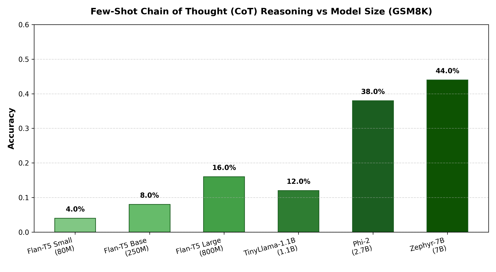

# 🧠 Reasoning for LLMs: Chain of Thought (CoT) Prompting & Model Scaling

An empirical research study and evaluation framework analyzing **Chain of Thought (CoT) Reasoning** performance across model architectures (Seq2Seq & Causal/Decoder LMs) and model sizes ranging from **80M to 7B parameters** on arithmetic reasoning benchmarks (**GSM8K** and **SVAMP**).

---

## 📌 Key Insights & Findings

1. **Emergence with Scale**: Chain-of-Thought reasoning gains meaningful traction primarily as parameter scale exceeds **~1B parameters**. Smaller models (e.g., Flan-T5 80M/250M) struggle with coherent multi-step deduction despite explicit few-shot CoT exemplars.
2. **Intermediate Reasoning Steps**: Providing step-by-step reasoning exemplars guides models to generate intermediate natural language deduction steps before emitting the final numerical answer.
3. **Arithmetic Bottleneck**: Even at 7B parameters (Zephyr-7B, Phi-2), raw arithmetic reasoning without external calculator tools or RL reasoning alignment (e.g., GRPO/PPO) remains vulnerable to calculation errors in multi-hop problems.

---

## 📊 Benchmark Results

| Model Architecture | Parameters | Model Identifier | GSM8K (Few-Shot CoT) |
| :--- | :--- | :--- | :---: |
| **Flan-T5 Small** | 80M | `google/flan-t5-small` | **4.0%** |
| **Flan-T5 Base** | 250M | `google/flan-t5-base` | **8.0%** |
| **Flan-T5 Large** | 800M | `google/flan-t5-large` | **16.0%** |
| **TinyLlama-1.1B** | 1.1B | `TinyLlama/TinyLlama-1.1B-Chat-v1.0` | **12.0%** |
| **Phi-2** | 2.7B | `microsoft/phi-2` | **38.0%** |
| **Zephyr-7B** | 7B | `HuggingFaceH4/zephyr-7b-alpha` | **44.0%** |

---
