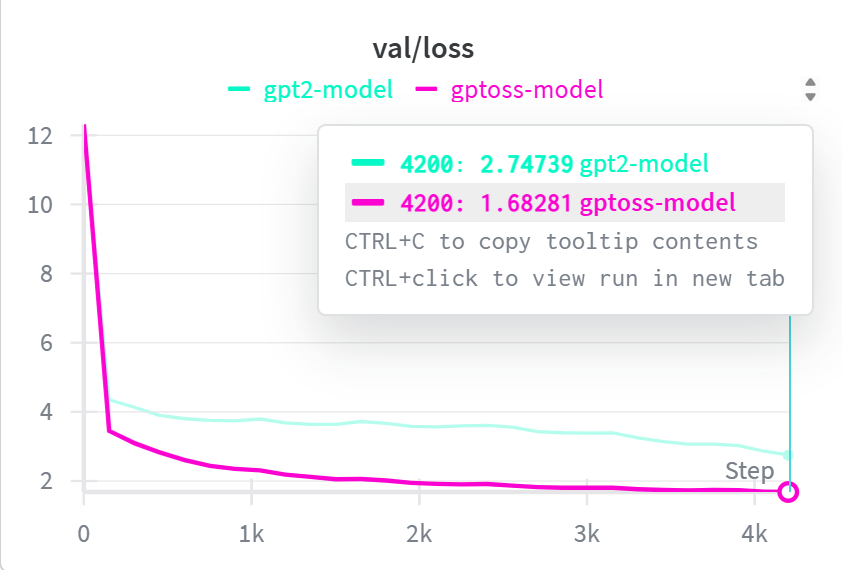

<div align="center">

# Nano-GPT-OSS Language Model

**An open-source transformer that balances full-context and sliding-window attention for efficient, scalable LLM training and inference.**

<a href="https://pytorch.org"></a>
<a href="https://huggingface.co"></a>
<a href="https://opensource.org/licenses/MIT"></a>



</div>

## Training & Validation Loss

| loss | Training Loss| Validation Loss | Num Heads | Trf BLock | Hidden Dim |
|--------|---------|---------|----------|----------|----------|
| GPT-OSS | **1.981** | **1.682** | 12 | 12 | 1020 |
| GPT2 | 3.124 | 2.747 | 12 | 12 | 1020 |
| GPT-OSS | **2.034** | **1.725** | 12 | 8 | 1020 |
| GPT2 | 2.593 | 2.173 | 12 | 8 | 1020 |
| GPT-OSS | **2.031** | **1.778** | 12 | 6 | 1020 |
| GPT2 | 2.570 | 2.331 | 12 | 6 | 1020 |
| GPT-OSS | **1.984** | **1.678** | 8 | 12 | 1024 |
| GPT2 | 2.445 | 2.036 | 8 | 12 | 1024 |
| GPT-OSS | **2.212** | **1.901**| 8 | 8 | 1024 |
| GPT2 | 2.416 | 2.011 | 8 | 8 | 1024 |
| GPT-OSS | **2.075** | **1.760** | 8 | 6 | 1024 |
| GPT2 | 2.734 | 2.323 | 8 | 6 | 1024 |
| GPT-OSS | **1.943** | **1.684** | 6 | 12 | 1020 |
| GPT2 | 2.748 | 2.366 | 6 | 12 | 1020 |
| GPT-OSS | **2.014** | **1.767** | 6 | 8 | 1020 |
| GPT2 | 2.594 | 2.213 | 6 | 8 | 1020 |
| GPT-OSS | **2.125** | **1.820** | 6 | 6 | 1020 |
| GPT2 | 2.784 | 2.366 | 6 | 6 | 1020 |

---
## Key Improvements of GPT-OSS over GPT-2

### 🏗️ Architecture Enhancements
- **Mixture of Experts (MoE) in MLP** with a Router → Sparse experts active per token (big model capacity, low active FLOPs)
- **Gated Router** → Token-dependent routing to experts (shown inside MoE block)
- **SwiGLU Feed-Forward (FFN) modules** → Modern activation in FFN instead of GELU
- **Grouped Query Attention + RoPE** → Alternate attention that supports longer context and stable queries
- **Sliding Window Attention** → Efficient attention pattern that reduces computation while maintaining context
- **Sink Slots in Attention** → Learned aggregation slots for global context stability
- **RMSNorm** → More stable normalization layer

### 📊 Performance Improvements
- **Lower Training Loss** → Better convergence during training
- **Lower Validation Loss** → Better generalization to unseen data
- **Lower Memory Usage** → More efficient memory usage during training and inference
- **Lower Disk Space** → More efficient disk space usage during training and inference
- **Lower Inference Time** → Faster inference time during inference

## Dependencies
- [pytorch](https://pytorch.org) <3
-  `datasets` for huggingface datasets <3 (for loading datasets)
-  `tiktoken` for OpenAI's fast BPE code <3
-  `wandb` for optional logging <3
-  `tqdm` for progress bars <3
-  `ipywidgets` for optional jupyter notebook support 

## 📊 Dataset and Format

TinyStories can be found at [HuggingFace Datasets](https://huggingface.co/datasets/roneneldan/TinyStories).

### Data Fields:

Each story entry contains:

- `story`: The main story text
<details>
<summary>📝 Click to see example story</summary>

**Story:**

```
Once upon a time, there was a big, red ball that could bounce very high...
```

\[Rest of the example story\]

</details>

## 🚀 Installation


### 📦 Pip Installation

```bash
# Clone the repo
git clone https://github.com/shobhitagnihotri69/nano-gpt-oss
cd nano-gpt-oss

# (Optional) create conda environment
conda create -n myenv python=3.10
conda activate myenv

# Install PyTorch: https://pytorch.org/get-started/
# Then install remaining requirements
pip install -r requirements.txt
```


## ⚡ Quick Demo

```python
from architecture.gptoss import GPTModel
import torch

# Load a trained checkpoint
model = GPTModel.from_checkpoint("checkpoints/best.pt")
model.eval()

# Generate text
output = model.generate("Once upon a time", max_new_tokens=100)
print(output)
```

---

## How to Train

The system auto-detects available GPU resources.

### Option 1: Command Line

```bash
cd nano-gpt-oss
python train.py
```

### Option 2: Jupyter Notebook

```bash
jupyter notebook
# Open trains.ipynb → Cell > Run All
```

### Monitoring
- Progress printed to console
- Checkpoints saved to `checkpoints/`
- Logs saved to `logs/`


## 1. Loss Curves Analysis

### 1.1 Validation Loss Comparison (Best Config Per Depth)

| Model Depth | GPT-OSS Val Loss | GPT2 Val Loss | Improvement |
|-------------|------------------|---------------|-------------|
| 6 Layers    | **1.760**        | 2.323         | **24.2%**   |
| 8 Layers    | **1.725**        | 2.173         | **20.6%**   |
| 12 Layers   | **1.682**        | 2.747         | **38.7%**   |

> Numbers drawn from full benchmark table above (best-performing head/dim config at each depth).

### 1.2 Key Observations

- **Parameter Efficiency**: GPT-OSS consistently achieves better validation loss at the same parameter budget, demonstrating superior architecture design.
- **Scales With Depth**: The performance gap grows at larger depths — 38.7% improvement at 12 layers vs 24.2% at 6 layers — suggesting MoE + SwiGLU provide compounding gains with scale.
- **Training Stability**: GPT-OSS exhibits smoother loss curves across all configurations, attributed to RMSNorm + RoPE replacing LayerNorm + learned position embeddings.

### 1.3 Why the Improvement Compounds at Scale

The MoE routing gate activates only 4 of 32 experts per token. At 6 layers this is marginal, but at 12 layers the sparse expert specialization has more depth to compound — each expert can develop stronger, more distinct representations. This matches DeepSeek-V2/V3's findings at much larger scale.

---

