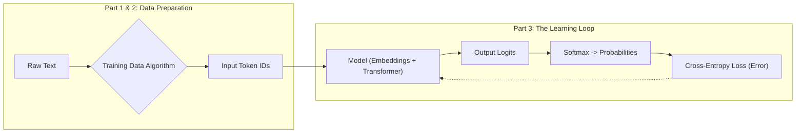

# **Title: LLM Pre-Training in 30 Minutes**

### Introduction: The Magic is Just Math

You've mastered how a neural network learns. You've seen the elegant dance of gradient descent and backpropagation, the mathematical engine that allows a machine to get progressively better at a task by minimizing its error. But that was with numbers. Clean, predictable, logical numbers.

Now we tackle language.

When a model like ChatGPT writes code, explains quantum physics, or composes a sonnet, it seems like magic. Here's the secret: it's the *exact same learning process*, applied relentlessly to one deceptively simple task: **predict the next token.**

In this tutorial, we will deconstruct the GPT-2 pre-training pipeline step by step. You will learn the exact algorithms and mathematics that allow a machine to teach itself from the raw, unlabeled text of the internet. We will build the entire conceptual pipeline, showing you exactly how "The cat sat on the" becomes a prediction for "mat," and how doing this billions of times creates the emergent intelligence you see today.

We will cover three key stages, anchored by this roadmap:



By the end, you will understand:
1.  **Data Preparation:** How we turn the entire internet into an infinite source of free training examples.
2.  **The Learning Loop:** How the model makes a prediction, measures its own error, and systematically corrects itself.

Let's begin by tackling the single biggest bottleneck in the history of AI: data.

## **Part 1: The Data Revolution - Learning Without Labels**

#### The Problem: The Expensive Reality of Supervised Learning

You've seen neural networks master tasks through supervised learning. The recipe is simple: give the model an input (like an image) and a correct output (the label "cat"), and it learns to map one to the other.

But there's a massive bottleneck: getting that labeled training data is painfully expensive and fundamentally limiting. Consider the real-world costs:

*   **Medical Imaging:** Radiologists, who charge hundreds of dollars per hour, are needed to label tumors in MRI scans.
*   **Legal Documents:** Lawyers, billing even more, are required to classify contracts or find evidence in discovery documents.
*   **Scientific Research:** PhD researchers can spend months or years meticulously annotating datasets for their experiments.

This creates two fundamental problems:

1.  **The Scale Ceiling:** The famous ImageNet dataset, with its 14 million labeled images, took years and millions of dollars to create. Yet, this is a tiny fraction of the billions of unlabeled images on the internet that we can't use.
2.  **The "Garbage In, Garbage Out" Problem:** The quality of the model is capped by the quality of its labels. Getting high-quality annotations requires true experts, making the process even more expensive and less scalable.

Supervised learning, for all its power, hits a wall. How do you get to billions or trillions of training examples if every single one requires an expensive human expert?

#### The Breakthrough: The Self-Supervised Engine

The genius of models like GPT-2 wasn't just a bigger architecture—it was abandoning the need for human labels entirely. Instead of asking a human, "What is the right answer?", it asks the text itself.

The task is deceptively simple: **predict the next word.**

That's it. No human annotation is needed. The text provides both the input (the sequence of words so far) and the "label" (the very next word in the sequence). This is the core of **self-supervised learning**.

We promised you an algorithm, and here is the simple, powerful engine that turns any document into an almost unlimited supply of training data.

```
// ALGORITHM: CreateTrainingData

INPUT: A document of text, broken into a list of words/tokens T.
       T = [t_1, t_2, t_3, ..., t_n]

OUTPUT: A set of (input, output) pairs for training.

FOR k FROM 1 TO n-1:
  input_sequence = [t_1, ..., t_k]
  target_word = t_{k+1}
  
  ADD (input_sequence, target_word) TO output_set

RETURN output_set
```

#### Step-by-Step Example: Slicing a Sentence

Let's see this algorithm in action. Take the simple sentence: **"The cat sat on the mat."**

The training process doesn't see this sentence just once. It systematically slides a window across it, turning one sentence into a full curriculum.

| | Input Sequence (What the model sees) | Target Output (What it must predict) |
| :--- | :--- | :--- |
| **Example 1** | ["The"] | `cat` |
| **Example 2** | ["The", "cat"] | `sat` |
| **Example 3** | ["The", "cat", "sat"] | `on` |
| **Example 4** | ["The", "cat", "sat", "on"] | `the` |
| **Example 5** | ["The", "cat", "sat", "on", "the"]| `mat` |

One sentence just generated five high-quality, perfectly labeled training examples for free.

#### Why Does Predicting the Next Word Create Intelligence?

At first, this seems too simple. How can guessing the next word teach a model to reason, write code, or explain science?

Because to get *consistently good* at this task across billions of examples, the model is forced to build a deep, internal understanding of the world. Imagine the model is given the following input text and must predict the single next word:

**"In Paris, the capital of France, the primary language spoken is..."**

What must the model learn to accurately predict the word `French`?

1.  **It needs to understand grammar:** It recognizes that the verb "is" will likely be followed by a noun or adjective.
2.  **It needs to handle long-distance context:** It must connect the end of the sentence back to the subject, "Paris," which appeared many words earlier.
3.  **It needs to learn facts about the world:** It must know that Paris is the capital of France, and that the language spoken in France is French.
4.  **It needs to ignore distractors:** It must realize that the word "primary" is less important than "France" for determining the language.

The only way for the model to minimize its prediction error across trillions of examples like this is to develop a rich internal model of concepts, facts, and the relationships between them. It's not memorizing; it's learning the underlying patterns of reality as reflected in human language.

#### Connecting to Reality: The Power of Scale

This self-supervised approach caused a paradigm shift in the scale of AI.

| Era | Dataset Example | Size | Parameters | Human Labeling? |
| :--- | :--- | :--- | :--- | :--- |
| **Traditional ML** | MNIST Digits | ~60,000 images (Megabytes) | 1-10 Million | **Yes** |
| **Deep Learning** | ImageNet | 14 Million images (Gigabytes) | 25-150 Million | **Yes** |
| **GPT-2 Era** | WebText | 40GB of text (~8M pages) | **1.5 Billion** | **No** |

The leap is staggering. A single 2,000-word Wikipedia article is automatically converted into **1,999** individual training examples. Scale that across the 40GB of text GPT-2 was trained on, and you have **billions** of learning opportunities, all for free.

We've solved the data problem by turning the internet into an infinitely large, self-labeling textbook.

Now that we understand the *task*, let's tackle the next critical step: how do we turn these words into numbers our neural network can actually process? This is where we move to **Tokenization**.

## **Part 2: Tokenization - Turning Language into LEGO Bricks**

We've established our learning task: predict the next piece of text. But our neural network doesn't understand "text"; it understands numbers. The process of converting raw text into a list of numbers the model can process is called **Tokenization**.

At first glance, this seems simple. Why not just split sentences by spaces? Or go even smaller and use individual characters? Let's explore why these naive approaches fail.

Consider the sentence: **"The cat quickly jumped."**

*   **Word-level tokenization** would give us: `["The", "cat", "quickly", "jumped."]`
*   **Character-level tokenization** would give us: `["T", "h", "e", " ", "c", "a", "t", ...]`

Both of these simple methods create immediate and severe problems.

| Problem | Word-Level Issues | Character-Level Issues |
| :--- | :--- | :--- |
| **Massive Vocabulary** | Is "The" different from "the"? Are "jump", "jumps", and "jumping" all unique words? The vocabulary would need to store every single variation, making it enormous. | Solved. The vocabulary is tiny (A-Z, 0-9, punctuation). |
| **Unknown Words** | What happens with a new word like "hyper-threading" or a typo like "awesommmme"? The model has no entry for it. This is a critical failure point known as the **Out-of-Vocabulary (OOV)** problem. | Solved. Any word can be constructed from characters. |
| **Sequence Length** | Sequences are short and manageable. "The cat jumped." is 4 tokens. | **Massive Inefficiency.** A 4-word sentence becomes over 20 tokens. A paragraph becomes thousands. The model must process each character one by one, making learning patterns across long distances slow and difficult. |

We need a solution that gives us the best of both worlds: a manageable vocabulary that can still represent any word without creating absurdly long sequences. Modern language models solve this with a clever technique called **Subword Tokenization**.

#### The LEGO Brick Approach: Subword Tokenization

The core idea is brilliant: **Don't treat words as the smallest unit.** Instead, break them down into smaller, common pieces, just like building things with LEGO bricks. The tokenizer learns these common pieces from the training data itself.

Let's see how a real subword tokenizer might handle our examples:

*   The common word "cat" is treated as a single token: `["cat"]`
*   The word "quickly" is broken into two common pieces: `["quick", "##ly"]`
*   The word "jumping" becomes two familiar parts: `["jump", "##ing"]`

The `##` is a special symbol that simply means "this token is attached to the previous one." This elegant solution solves all of our earlier problems:

1.  **It Creates an Efficient Vocabulary:** Instead of needing separate entries for `jump`, `jumps`, `jumping`, and `jumper`, the tokenizer only needs to know the common stem `jump` and the common subwords `##s`, `##ing`, and `##er`. This keeps the vocabulary size manageable (GPT-2 uses about 50,000 tokens).
2.  **It Eliminates Unknown Words:** How does it handle a new, complex word like "hyper-threading"? It can build it from its LEGO bricks: `["hyper", "-", "thread", "##ing"]`. What about a typo like "awesommmme"? It might break it down into `["awesome", "##m", "##m", "##e"]`. The model can represent **any** word by breaking it down into a combination of known subwords and, in the worst case, individual characters.

#### The Final Output: Integer IDs

After the text is broken into these subword tokens, the tokenizer looks up each token in its vocabulary to get a unique integer ID. These IDs are what actually get fed into our model as the **Input Tokens** in our architecture diagram.

Let's imagine a small part of a learned vocabulary:

| Token | Token ID |
| :--- | :---: |
| "The" | 5 |
| "cat" | 8 |
| "quick" | 73 |
| "##ly" | 152 |
| "jump" | 311 |
| "##ed" | 94 |

The full tokenization process for "The cat quickly jumped" would look like this:

1.  **Input Text:** "The cat quickly jumped"
2.  **Subword Splitting:** `["The", "cat", "quick", "##ly", "jump", "##ed"]`
3.  **Final Output (Token IDs):** `[5, 8, 73, 152, 311, 94]`

This final list of numbers is what represents our sentence. But these numbers are just labels. ID `73` doesn't have any mathematical relationship to ID `8`. They are just arbitrary pointers.
