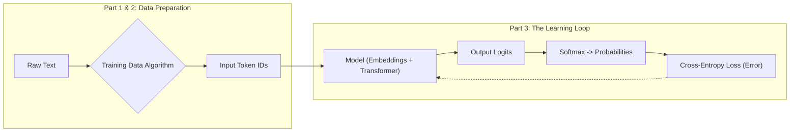

# **Title: LLM Pre-Training in 30 Minutes**

### Introduction: The Magic is Just Math

You've mastered how a neural network learns. You've seen the elegant dance of gradient descent and backpropagation, the mathematical engine that allows a machine to get progressively better at a task by minimizing its error. But that was with numbers. Clean, predictable, logical numbers.

Now we tackle language.

When a model like ChatGPT writes code, explains quantum physics, or composes a sonnet, it seems like magic. Here's the secret: it's the *exact same learning process*, applied relentlessly to one deceptively simple task: **predict the next token.**

In this tutorial, we will deconstruct the GPT-2 pre-training pipeline step by step. You will learn the exact algorithms and mathematics that allow a machine to teach itself from the raw, unlabeled text of the internet. We will build the entire conceptual pipeline, showing you exactly how "The cat sat on the" becomes a prediction for "mat," and how doing this billions of times creates the emergent intelligence you see today.

We will cover three key stages, anchored by this roadmap:

By the end, you will understand:
1.  **Data Preparation:** How we turn the entire internet into an infinite source of free training examples.
2.  **The Learning Loop:** How the model makes a prediction, measures its own error, and systematically corrects itself.

Let's begin by tackling the single biggest bottleneck in the history of AI: data.

## **Part 1: The Data Revolution - Learning Without Labels**

#### The Problem: The Expensive Reality of Supervised Learning

You've seen neural networks master tasks through supervised learning. The recipe is simple: give the model an input (like an image) and a correct output (the label "cat"), and it learns to map one to the other.

But there's a massive bottleneck: getting that labeled training data is painfully expensive and fundamentally limiting. Consider the real-world costs:

*   **Medical Imaging:** Radiologists, who charge hundreds of dollars per hour, are needed to label tumors in MRI scans.
*   **Legal Documents:** Lawyers, billing even more, are required to classify contracts or find evidence in discovery documents.
*   **Scientific Research:** PhD researchers can spend months or years meticulously annotating datasets for their experiments.

This creates two fundamental problems:

1.  **The Scale Ceiling:** The famous ImageNet dataset, with its 14 million labeled images, took years and millions of dollars to create. Yet, this is a tiny fraction of the billions of unlabeled images on the internet that we can't use.
2.  **The "Garbage In, Garbage Out" Problem:** The quality of the model is capped by the quality of its labels. Getting high-quality annotations requires true experts, making the process even more expensive and less scalable.

Supervised learning, for all its power, hits a wall. How do you get to billions or trillions of training examples if every single one requires an expensive human expert?
