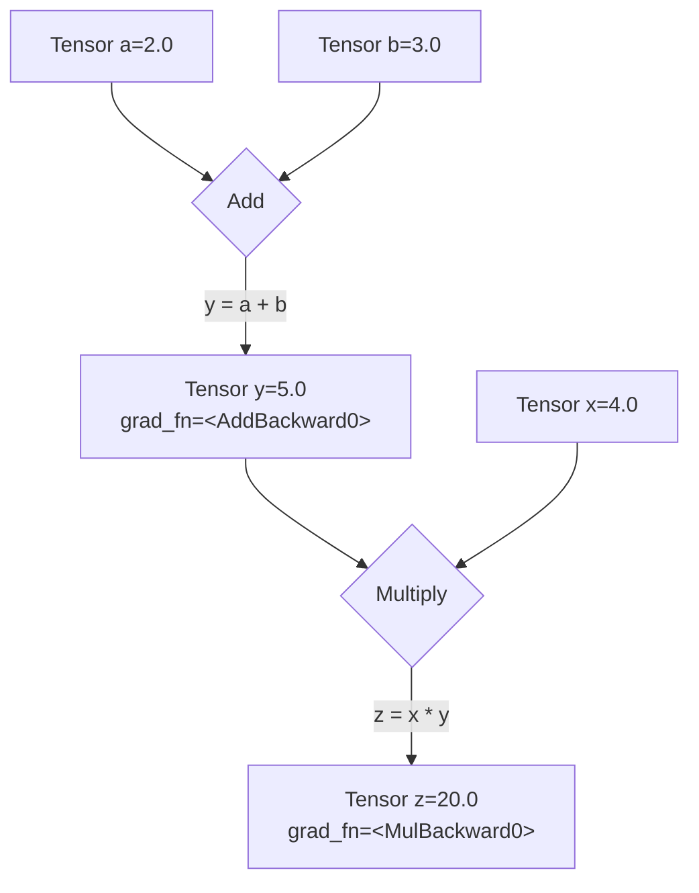

# **Give Me 1 Hour, You Will Build and Train a Neural Network From Scratch**

## Intro

You've seen PyTorch code. Maybe in a research paper or a tutorial. You saw `model.train()`, `loss.backward()`, and `optimizer.step()`.

You wondered what they actually *do*.

Maybe you tried to read the documentation. Got hit with a wall of classes. `nn.Module`, `torch.optim`, computation graphs. It felt like opaque, magical black boxes.

**Here's the truth: They're not black boxes. They are elegant wrappers for the linear algebra and calculus you already know.**

The entire deep learning training process, from the simplest model to a giant LLM, is just a five-step algorithm. That's it. Everything else is just an implementation detail.

- The `nn.Linear` layer? It's just `X @ W + b`.
- The loss function? Just a formula to measure error, like `torch.mean((y - y_hat)**2)`.
- The magical `loss.backward()`? It's just your old friend, the chain rule (backpropagation), automated.
- The `optimizer.step()`? It's just the gradient descent update rule: `W -= learning_rate * W.grad`.

**In this guide, we'll implement the raw math first, then use PyTorch's professional tools.**

You'll see *why* the tools exist by first doing the work manually. Once you've implemented the raw math, the professional code becomes obvious—just a clean, powerful way to organize what you've already built.

**And it all boils down to these 5 steps.**

Master this five-step loop, and you can understand the training code for any model, from a simple regression to a state-of-the-art Large Language Model.

| Step | Concept (Math) | From Scratch (Raw Tensors) | Professional (`torch.nn`) |
| :--- | :--- | :--- | :--- |
| **1. Prediction** | Make a prediction: <br> `ŷ = f(X, θ)` | `y_hat = X @ W + b` | `y_hat = model(X)` |
| **2. Loss Calc** | Quantify the error: <br> `L = Loss(ŷ, y)` | `loss = torch.mean((y_hat - y)**2)` | `loss = criterion(y_hat, y)` |
| **3. Gradient Calc** | Find the slope of the loss: <br> `∇_θ L` | `loss.backward()` | `loss.backward()` |
| **4. Param Update** | Step down the slope: <br> `θ_t+1 = θ_t - η * ∇_θ L` | `W -= lr * W.grad` | `optimizer.step()` |
| **5. Gradient Reset** | Reset for the next loop. | `W.grad.zero_()` | `optimizer.zero_grad()` |

Even better—this loop is universal. The `model` in Step 1 might become a massive Transformer, and the `optimizer` in Step 4 might be a fancy one like Adam, but the fundamental five-step logic **never changes**.

This isn't an analogy. The `nn.Linear` layer used in LLMs is the *exact same* `X @ W + b` operation you will build in Part 2. The Feed-Forward Network inside a Transformer is the *exact same* stack of layers you will build in Part 4. You are learning the literal, fundamental building blocks of modern AI.

Give me one hour. We'll build your understanding from the ground up. Raw math, real code, and a clear path to the professional tools.

Ready? Let's begin.

## Part 1: The Core Data Structure - `torch.Tensor`

Welcome to PyTorch! Everything we do—from loading data to defining complex neural networks—will be built on one core object: the `torch.Tensor`.

**The Analogy:** Think of a `Tensor` as the fundamental building block, the basic "noun" of the PyTorch language. It's a multi-dimensional array, very similar to a NumPy array, but with special powers for deep learning that we will unlock step-by-step.

Our goal in this section is to master this single, crucial object: how to create it and how to understand its properties.

### 1.1. The Three Common Patterns for Creating Tensors

There are many ways to create a tensor, but they generally fall into three common patterns you'll see everywhere.

#### **Pattern 1: Direct Creation from Existing Data**
This is the most straightforward. You have a Python list of numbers, and you want to convert it into a PyTorch tensor using `torch.tensor()`.

```python
import torch

# Input: A standard Python list
data = [[1, 2, 3], [4, 5, 6]]
my_tensor = torch.tensor(data)

print(my_tensor)
```
**Output:**
```
tensor([[1, 2, 3],
        [4, 5, 6]])
```

---

#### **Pattern 2: Creation from a Desired Shape**
This is extremely common when building models. You don't know the exact values for your weights yet, but you know the dimensions (shape) you need.

*   `torch.ones()` or `torch.zeros()`: Fills the tensor with `1`s or `0`s.
*   `torch.randn()`: Fills the tensor with random numbers from a standard normal distribution. **This is the standard way to initialize a model's weights.**

```python
# Input: A shape tuple (2 rows, 3 columns)
shape = (2, 3)

# Create tensors with this shape
ones = torch.ones(shape)
zeros = torch.zeros(shape)
random = torch.randn(shape)

print(f"Ones Tensor:\n {ones}\n")
print(f"Zeros Tensor:\n {zeros}\n")
print(f"Random Tensor:\n {random}")
```
**Output:**
```
Ones Tensor:
 tensor([[1., 1., 1.],
        [1., 1., 1.]])

Zeros Tensor:
 tensor([[0., 0., 0.],
        [0., 0., 0.]])

Random Tensor:
 tensor([[ 0.3815, -0.9388,  1.6793],
        [-0.3421,  0.5898,  0.3609]])
```

---

#### **Pattern 3: Creation by Mimicking Another Tensor's Properties**
Often, you have an existing tensor and you need to create a new one that has the *exact same shape, data type, and is on the same device*. Instead of manually copying these properties, PyTorch provides handy `_like` functions.

```python
# Input: A 'template' tensor
template = torch.tensor([[1, 2], [3, 4]])

# Create new tensors with the same properties as the template
ones_like = torch.ones_like(template)
rand_like = torch.randn_like(template, dtype=torch.float) # dtype can be overridden

print(f"Template Tensor:\n {template}\n")
print(f"Ones_like Tensor:\n {ones_like}\n")
print(f"Randn_like Tensor:\n {rand_like}")
```
**Output:**
```
Template Tensor:
 tensor([[1, 2],
        [3, 4]])

Ones_like Tensor:
 tensor([[1, 1],
        [1, 1]])

Randn_like Tensor:
 tensor([[-1.1713, -0.2032],
        [ 0.3391, -0.8267]])
```

### 1.2. What's Inside a Tensor? Shape, Type, and Device

Every tensor has attributes that describe its metadata. The three you will use constantly are `.shape`, `.dtype`, and `.device`.

```python
# Let's create a tensor to inspect
tensor = torch.randn(2, 3)

print(f"Shape of tensor: {tensor.shape}")
print(f"Datatype of tensor: {tensor.dtype}")
print(f"Device tensor is stored on: {tensor.device}")
```
**Output:**
```
Shape of tensor: torch.Size([2, 3])
Datatype of tensor: torch.float32
Device tensor is stored on: cpu
```

Let's break these down:
*   **`.shape`**: This is a tuple that describes the dimensions of the tensor. `torch.Size([2, 3])` tells us it's a 2D tensor with 2 rows and 3 columns. This is the most important attribute for debugging your models. Mismatched shapes are the #1 source of errors in PyTorch.
*   **`.device`**: This tells you where the tensor's data is physically stored. By default, it's on the `cpu`. If you have a compatible GPU, you can move it there (`.to("cuda")`) for massive speedups.
*   **`.dtype`**: This describes the data type of the numbers inside the tensor. Notice it defaulted to `torch.float32`. This is not an accident, and it's critically important.

#### A Quick but Critical Note on `dtype`
Why `torch.float32` and not just regular integers (`int64`)? The answer is **gradients**.

Gradient descent, the engine of deep learning, works by making tiny, continuous adjustments to a model's weights. These adjustments are fractional numbers (like `-0.0012`), which require a floating-point data type. You can't nudge a parameter from `3` to `3.001` if your data type only allows whole numbers.

**Key Takeaway:**
*   Model parameters (weights and biases) **must** be a float type (`float32` is the standard).
*   Data that represents categories or counts (like word IDs) can be integers (`int64`).

---

We now know what a `torch.Tensor` is and how to create one using three common patterns. We've essentially learned about the raw material.

Now, let's explore the single most important switch that turns this simple data container into a core component of a dynamic learning machine. Let's move on to **Part 2: The Engine of Autograd**.

## Part 2: The Engine of Autograd - `requires_grad`

In Part 1, we learned that tensors are containers for numbers. But their real power comes from a system called **Autograd**, which stands for automatic differentiation. This is PyTorch's built-in gradient calculator.

**The Analogy:** If a tensor is the "noun" in PyTorch, then Autograd is the "nervous system." It connects all the operations and allows signals (gradients) to flow backward through the system, enabling learning.

Our goal here is to understand the *one simple switch* that activates this nervous system.

### 2.1. The "Magic Switch": `requires_grad=True`

By default, PyTorch assumes a tensor is just static data. To tell it that a tensor is a learnable parameter (like a model's weight or bias), you must set its `requires_grad` attribute to `True`.

This is the most important setting in all of PyTorch. It tells Autograd:
> "This is a parameter my model will learn. From now on, track every single operation that happens to it."

```python
# A standard data tensor (we don't need to calculate gradients for our input data)
x_data = torch.tensor([[1., 2.], [3., 4.]])
print(f"Data tensor requires_grad: {x_data.requires_grad}\n")

# A parameter tensor (we need to learn this, so we need gradients)
w = torch.tensor([[1.0], [2.0]], requires_grad=True)
print(f"Parameter tensor requires_grad: {w.requires_grad}")
```
**Output:**
```
Data tensor requires_grad: False

Parameter tensor requires_grad: True
```

### 2.2. The Computation Graph: How PyTorch Remembers

Once you set `requires_grad=True`, PyTorch starts building a **computation graph** behind the scenes. Think of it as a history of all the operations. Every time you perform an operation on a tensor that requires gradients, PyTorch adds a new node to this graph.

Let's build a simple one. We'll compute `z = x * y` where `y = a + b`.

```python
# Three parameter tensors that we want to learn
a = torch.tensor(2.0, requires_grad=True)
b = torch.tensor(3.0, requires_grad=True)
x = torch.tensor(4.0, requires_grad=True)

# First operation: y = a + b
y = a + b

# Second operation: z = x * y
z = x * y

print(f"Result of a + b: {y}")
print(f"Result of x * y: {z}")
```
**Output:**
```
Result of a + b: 5.0
Result of x * y: 20.0
```
The math is simple. But behind the scenes, PyTorch has built a graph connecting `a`, `b`, `x`, `y`, and `z`.

### 2.3. Peeking Under the Hood: The `.grad_fn` Attribute

How can we prove this graph exists? Every tensor that is the result of an operation on a `requires_grad` tensor will have a special attribute called `.grad_fn`. This attribute is a "breadcrumb" that points to the function that created it.

Let's inspect the tensors from our previous example.

```python
# z was created by multiplication
print(f"grad_fn for z: {z.grad_fn}")

# y was created by addition
print(f"grad_fn for y: {y.grad_fn}")

# a was created by the user, not by an operation, so it has no grad_fn
print(f"grad_fn for a: {a.grad_fn}")
```
**Output:**
```
grad_fn for z: <MulBackward0 object at 0x10f7d3d90>
grad_fn for y: <AddBackward0 object at 0x10f7d3d90>
grad_fn for a: None
```
This is the tangible proof of the computation graph. PyTorch knows `z` came from a multiplication (`MulBackward0`) and `y` came from an addition (`AddBackward0`). When we later ask it to compute gradients, it will use this information to trace its way backward through the graph using the chain rule.

### 2.4. Visualizing the Graph

Here is what the graph we just created looks like. The `grad_fn` is the "arrow" leading to each new tensor.



---

We have now learned how to activate PyTorch's "nervous system" by setting `requires_grad=True`. This allows PyTorch to build a computation graph and remember the history of all operations.

We have built the network of roads. In the next parts, we'll learn the common operations (the "verbs") and then see how to send the gradient signal flowing backward along these roads to enable learning. Let's move on to **Part 3: Basic Mathematical & Reduction Operations**.

## Part 3: Basic Mathematical & Reduction Operations

We have our `Tensor` (the noun) and `Autograd` (the nervous system). Now we need **operations** (the verbs) to describe the calculations our model will perform. In deep learning, the vast majority of these operations are surprisingly simple: matrix multiplications and aggregations.

Our goal is to master these core verbs and, most importantly, the critical `dim` argument that controls how they work.

### 3.1. Mathematical Operations: `*` vs. `@`

This is the single most common point of confusion for beginners. PyTorch has two very different kinds of multiplication.

**1. Element-wise Multiplication (`*`)**
This operation multiplies elements in the same position. It's like overlaying two tensors and multiplying the corresponding cells. The tensors **must have the same shape**.

```python
a = torch.tensor([[1, 2], [3, 4]])
b = torch.tensor([[10, 20], [30, 40]])

# Calculation: [[1*10, 2*20], [3*30, 4*40]]
element_wise_product = a * b

print(f"Tensor a:\n {a}\n")
print(f"Tensor b:\n {b}\n")
print(f"Element-wise Product (a * b):\n {element_wise_product}")
```
**Output:**
```
Tensor a:
 tensor([[1, 2],
        [3, 4]])

Tensor b:
 tensor([[10, 20],
        [30, 40]])

Element-wise Product (a * b):
 tensor([[ 10,  40],
        [ 90, 160]])
```

---

**2. Matrix Multiplication (`@`)**
This is the standard matrix product from linear algebra. It's the core operation of every `Linear` layer in a neural network. For `m1 @ m2`, the number of columns in `m1` must equal the number of rows in `m2`.

```python
m1 = torch.tensor([[1, 2, 3], [4, 5, 6]])   # Shape: (2, 3)
m2 = torch.tensor([[7, 8], [9, 10], [11, 12]]) # Shape: (3, 2)

# Calculation for the first element: (1*7) + (2*9) + (3*11) = 58
matrix_product = m1 @ m2 # Resulting shape: (2, 2)

print(f"Matrix 1 (shape {m1.shape}):\n {m1}\n")
print(f"Matrix 2 (shape {m2.shape}):\n {m2}\n")
print(f"Matrix Product (m1 @ m2):\n {matrix_product}")
```
**Output:**
```
Matrix 1 (shape torch.Size([2, 3])):
 tensor([[1, 2, 3],
        [4, 5, 6]])

Matrix 2 (shape torch.Size([3, 2])):
 tensor([[ 7,  8],
        [ 9, 10],
        [11, 12]])

Matrix Product (m1 @ m2):
 tensor([[ 58,  64],
        [139, 154]])
```

### 3.2. Reduction Operations

A "reduction" is any operation that reduces the number of elements in a tensor, often by aggregating them. Examples include `sum()`, `mean()`, `max()`, and `min()`.

```python
scores = torch.tensor([[10., 20., 30.], [5., 10., 15.]])

# By default, reductions apply to the entire tensor
total_sum = scores.sum()
average_score = scores.mean()

print(f"Scores Tensor:\n {scores}\n")
# Calculation: 10 + 20 + 30 + 5 + 10 + 15 = 90
print(f"Total Sum: {total_sum}")
# Calculation: 90 / 6 = 15
print(f"Overall Mean: {average_score}")
```
**Output:**
```
Scores Tensor:
 tensor([[10., 20., 30.],
        [ 5., 10., 15.]])

Total Sum: 90.0
Overall Mean: 15.0
```

### 3.3. The `dim` Argument: The Most Important Detail

This is where reductions become powerful. The `dim` argument tells the function which dimension to **collapse**.

A simple rule of thumb for 2D tensors:
*   `dim=0`: Collapses the **rows** (operates "vertically" ⬇️).
*   `dim=1`: Collapses the **columns** (operates "horizontally" ➡️).

Let's use our `scores` tensor (2 students, 3 assignments) to see this.

```python
scores = torch.tensor([[10., 20., 30.], [5., 10., 15.]])

# To get the sum FOR EACH ASSIGNMENT, we collapse the student dimension (dim=0)
# Calculation: [10+5, 20+10, 30+15]
sum_per_assignment = scores.sum(dim=0)

# To get the sum FOR EACH STUDENT, we collapse the assignment dimension (dim=1)
# Calculation: [10+20+30, 5+10+15]
sum_per_student = scores.sum(dim=1)

print(f"Original Scores:\n {scores}\n")
print(f"Sum per assignment (dim=0): {sum_per_assignment}")
print(f"Sum per student (dim=1):    {sum_per_student}")
```
**Output:**
```
Original Scores:
 tensor([[10., 20., 30.],
        [ 5., 10., 15.]])

Sum per assignment (dim=0): tensor([15., 30., 45.])
Sum per student (dim=1):    tensor([60., 30.])
```

This table visualizes exactly what happened:

| `scores` | Assignment 1 | Assignment 2 | Assignment 3 | `sum(dim=1)` ➡️ |
| :--- | :---: | :---: | :---: | :---: |
| Student 1 | 10 | 20 | 30 | **60** |
| Student 2 | 5 | 10 | 15 | **30** |
| `sum(dim=0)` ⬇️ | **15** | **30** | **45** | |

Mastering the `dim` argument is essential for everything from calculating loss functions to implementing attention mechanisms.

---

We now have the basic vocabulary of calculation and aggregation. We know how to multiply matrices and how to sum up results across specific dimensions.

Now let's look at more advanced "verbs" for selecting and manipulating data. Let's move on to **Part 4: Advanced Indexing & Selection Primitives**.

## Part 4: Advanced Indexing & Selection Primitives

If basic math ops are the "verbs" of PyTorch, then indexing primitives are the "adverbs" and "prepositions"—they let you specify *which* data to act upon with great precision.

Our goal is to learn how to select data in increasingly sophisticated ways, moving from uniform block selection to dynamic, per-row lookups.

### 4.1. Standard Indexing: The Basics

This works just like in Python lists or NumPy. It's for selecting uniform "blocks" of data, like entire rows or columns.

```python
# A simple, easy-to-read tensor
x = torch.tensor([[0, 1, 2, 3],
                  [4, 5, 6, 7],
                  [8, 9, 10, 11]])

# Get the second row (at index 1)
row_1 = x[1]
print(f"Row 1: {row_1}\n")

# Get the third column (at index 2)
col_2 = x[:, 2]
print(f"Column 2: {col_2}\n")

# Get a specific element (row 1, column 3)
element_1_3 = x[1, 3]
print(f"Element at (1, 3): {element_1_3}")
```
**Output:**
```
Row 1: tensor([4, 5, 6, 7])

Column 2: tensor([ 2,  6, 10])

Element at (1, 3): 7
```

### 4.2. Boolean Masking: Selection by Condition

Instead of using integer indices, you can use a boolean (True/False) tensor to select only the elements where the mask is `True`.

```python
x = torch.tensor([[0, 1, 2, 3], [4, 5, 6, 7]])

# Step 1: Create the boolean mask
mask = x > 3
print(f"The Boolean Mask (x > 3):\n {mask}\n")

# Step 2: Apply the mask to the tensor
selected_elements = x[mask]
print(f"Selected elements: {selected_elements}")
```
**Output:**
```
The Boolean Mask (x > 3):
 tensor([[False, False, False, False],
        [ True,  True,  True,  True]])

Selected elements: tensor([4, 5, 6, 7])
```
**Note:** Boolean selection always returns a 1D tensor, as it pulls out only the matching values.

### 4.3. Conditional Creation: `torch.where()`

This is the tensor equivalent of a ternary `if/else` statement. It creates a **new tensor** by choosing values from two other tensors based on a condition. The syntax is `torch.where(condition, value_if_true, value_if_false)`.

```python
x = torch.tensor([0, 1, 2, 3, 4, 5, 6, 7, 8, 9])

# Create a new tensor: if a value in x is > 4, use -1, otherwise use the original value
y = torch.where(x > 4, -1, x)

print(f"Original Tensor: {x}")
print(f"Result of where: {y}")
```
**Output:**
```
Original Tensor: tensor([0, 1, 2, 3, 4, 5, 6, 7, 8, 9])
Result of where: tensor([ 0,  1,  2,  3,  4, -1, -1, -1, -1, -1])
```

### 4.4. Primitives for Finding the "Best" Items

After a model makes a prediction, we often need to find the item with the highest score.
*   `torch.argmax()`: Finds the **index** of the single maximum value.
*   `torch.topk()`: Finds the `k` largest **values and their indices**.

```python
scores = torch.tensor([
    [10, 0, 5, 20, 1],  # Scores for item 0
    [1, 30, 2, 5, 0]   # Scores for item 1
])

# Find the index of the best score for each item
best_indices = torch.argmax(scores, dim=1)
# For row 0, max is 20 at index 3. For row 1, max is 30 at index 1.
print(f"Argmax indices: {best_indices}\n")

# Find the top 3 scores and their indices for each item
top_values, top_indices = torch.topk(scores, k=3, dim=1)
print(f"Top 3 values:\n {top_values}\n")
print(f"Top 3 indices:\n {top_indices}")
```
**Output:**
```
Argmax indices: tensor([3, 1])

Top 3 values:
 tensor([[20, 10,  5],
        [30,  5,  2]])

Top 3 indices:
 tensor([[3, 0, 2],
        [1, 3, 2]])
```

### 4.5. Primitive for Dynamic Lookups: `torch.gather()`

This is the most advanced and powerful selection tool.

**The Problem:** Standard indexing is for *uniform* selection (e.g., "get column 2 for *all* rows"). But what if you need to select a **different column for each row**?
*   From row 0, get the element at column 2.
*   From row 1, get the element at column 0.
*   From row 2, get the element at column 3.

**The Solution:** `torch.gather()` is purpose-built for this "dynamic lookup." You provide an `index` tensor that acts as a personalized list of which element to grab from each row.

```python
data = torch.tensor([
    [10, 11, 12, 13],  # row 0
    [20, 21, 22, 23],  # row 1
    [30, 31, 32, 33]   # row 2
])

# Our "personalized list" of column indices to select from each row
indices_to_select = torch.tensor([[2], [0], [3]])

# Gather from `data` along dim=1 (the column dimension)
selected_values = torch.gather(data, dim=1, index=indices_to_select)

print(f"Selected Values:\n {selected_values}")
```
**Output:**
```
Selected Values:
 tensor([[12],  # From row 0, we gathered the element at index 2
        [20],  # From row 1, we gathered the element at index 0
        [33]]) # From row 2, we gathered the element at index 3
```
This single, optimized operation avoids a slow Python `for` loop and is a cornerstone of many advanced model architectures.

---

We have now learned a powerful set of verbs for calculation, aggregation, and selection. We have all the tools we need.

It's time to put them together. Let's start building our neural network from scratch. Let's move on to **Part 5: The Forward Pass - Manually Making a Prediction**.

## Part 5: The Forward Pass - Manually Making a Prediction

The **"Forward Pass"** is the process of taking input data and passing it *forward* through the model's layers to get an output, or prediction. It's the first step in our five-step training loop.

**The Analogy:** Think of the forward pass as the model's "guess." We show it a problem (the input `X`) and it gives us its current best answer (the prediction `ŷ`).

Our goal is to implement a simple linear regression model's forward pass from scratch, using only the raw tensor operations we've already learned.

### 5.1. The Model: Simple Linear Regression

Our model's job is to learn the relationship between one input variable (`x`) and one output variable (`y`). The formula from linear algebra is our blueprint:

`ŷ = XW + b`

Where:
*   `X` is our input data.
*   `W` is the **weight** parameter.
*   `b` is the **bias** parameter.
*   `ŷ` (pronounced "y-hat") is our model's **prediction**.

Our goal is to find the best `W` and `b` to make `ŷ` as close to the true `y` as possible.

### 5.2. The Setup: Creating Our Data

We don't have a real dataset, so let's create a synthetic one. We'll generate data that follows a clear pattern, and then see if our model can learn it. Let's create data that follows the line `y = 2x + 1`, with a little bit of random noise added.

```python
# We'll create a "batch" of 10 data points
N = 10
# Each data point has 1 feature
D_in = 1
# The output for each data point is a single value
D_out = 1

# Create our input data X
# Shape: (10 rows, 1 column)
X = torch.randn(N, D_in)

# Create our true target labels y by applying the "true" function
# and adding some noise for realism
true_W = torch.tensor([[2.0]])
true_b = torch.tensor(1.0)
y_true = X @ true_W + true_b + torch.randn(N, D_out) * 0.1 # Add a little noise

print(f"Input Data X (first 3 rows):\n {X[:3]}\n")
print(f"True Labels y_true (first 3 rows):\n {y_true[:3]}")
```
**Output:**
```
Input Data X (first 3 rows):
 tensor([[-0.5186],
        [-0.2582],
        [-0.3378]])

True Labels y_true (first 3 rows):
 tensor([[-0.1030],
        [ 0.4491],
        [ 0.3340]])
```

### 5.3. The Parameters: The Model's "Brain"

Now, we create the parameters `W` and `b` that our model will learn. We initialize them with random values. Most importantly, we set `requires_grad=True` to tell PyTorch's Autograd engine to start tracking them.

```python
# Initialize our parameters with random values
# Shapes must be correct for matrix multiplication: X(10,1) @ W(1,1) -> (10,1)
W = torch.randn(D_in, D_out, requires_grad=True)
b = torch.randn(1, requires_grad=True)

print(f"Initial Weight W:\n {W}\n")
print(f"Initial Bias b:\n {b}")
```
**Output:**
```
Initial Weight W:
 tensor([[0.4137]], requires_grad=True)

Initial Bias b:
 tensor([0.2882], requires_grad=True)
```
Our model's current "knowledge" is that the weight is `0.4137` and the bias is `0.2882`. This is completely random and wrong, but it's a starting point.

### 5.4. The Implementation: From Math to Code

Now for the main event. We translate our mathematical formula `ŷ = XW + b` directly into a single line of PyTorch code.

```python
# Perform the forward pass to get our first prediction
y_hat = X @ W + b

print(f"Shape of our prediction y_hat: {y_hat.shape}\n")
print(f"Prediction y_hat (first 3 rows):\n {y_hat[:3]}\n")
print(f"True Labels y_true (first 3 rows):\n {y_true[:3]}")
```
**Output:**
```
Shape of our prediction y_hat: torch.Size([10, 1])

Prediction y_hat (first 3 rows):
 tensor([[ 0.0737],
        [ 0.1812],
        [ 0.1485]], grad_fn=<AddBackward0>)

True Labels y_true (first 3 rows):
 tensor([[-0.1030],
        [ 0.4491],
        [ 0.3340]])
```
Notice two things:
1.  The shape of `y_hat` is `(10, 1)`, which perfectly matches the shape of `y_true`. This is crucial.
2.  `y_hat` has a `grad_fn=<AddBackward0>`. This is Autograd at work! PyTorch has already built the computation graph, remembering that `y_hat` was created by adding the bias `b` to the result of the matrix multiplication `X @ W`.

As expected, our initial predictions are terrible. They're nowhere near the true labels. This is because our `W` and `b` are random.

We've successfully made a guess. The next logical question is: **how do we measure exactly *how wrong* our guess is?**

This leads us directly to the concept of the loss function. Let's move on to **Part 6: The Backward Pass - Manually Calculating Gradients**.

## Part 6: The Backward Pass - Calculating Gradients

If the forward pass was the model's "guess," the backward pass is the "post-mortem analysis." We compare the guess to the truth, calculate how wrong we were, and then determine *exactly how to change each parameter* to be less wrong next time.

**The Analogy:** Imagine you're tuning a complex radio with two knobs (`W` and `b`) to get a clear signal (the true `y`). The forward pass is listening to the current static (`y_hat`). The backward pass is figuring out which direction to turn each knob (`W.grad` and `b.grad`) to reduce the static.

Our goal is to quantify our model's error and then use Autograd's magic to calculate the gradients—the direction of steepest ascent of the error.

### 6.1. Defining Error: The Loss Function

We need a single number that tells us how "wrong" our predictions are. This is called the **Loss**. For regression, the most common loss function is the **Mean Squared Error (MSE)**.

The formula is simple:
`L = (1/N) * Σ(ŷ_i - y_i)²`

In plain English: "For every data point, find the difference between the prediction and the truth, square it, and then take the average of all these squared differences."

Let's translate this directly into PyTorch code, using the `y_hat` from Part 5.

```python
# y_hat is our prediction from the forward pass
# y_true is the ground truth
# Let's calculate the loss manually
error = y_hat - y_true
squared_error = error ** 2
loss = squared_error.mean()

print(f"Prediction (first 3):\n {y_hat[:3]}\n")
print(f"Truth (first 3):\n {y_true[:3]}\n")
print(f"Loss (a single number): {loss}")
```
**Output:**
```
Prediction (first 3):
 tensor([[ 0.0737],
        [ 0.1812],
        [ 0.1485]], grad_fn=<SliceBackward0>)

Truth (first 3):
 tensor([[-0.1030],
        [ 0.4491],
        [ 0.3340]])

Loss (a single number): 1.6322047710418701
```
We now have a single number, `1.6322`, that quantifies our model's total error. Our goal is to make this number as small as possible. Notice that the `loss` tensor also has a `grad_fn`, because it's the result of operations on our parameters. It's the root of our computation graph.

### 6.2. The Magic Command: `loss.backward()`

This is where the magic of Autograd happens. With a single command, we tell PyTorch to send a signal backward from the `loss` through the entire computation graph it built during the forward pass.

This command calculates the gradient of the `loss` with respect to every single parameter that has `requires_grad=True`. In our case, it will compute:
*   `∂L/∂W` (the gradient of the Loss with respect to our Weight `W`)
*   `∂L/∂b` (the gradient of the Loss with respect to our Bias `b`)

```python
# The backward pass
loss.backward()
```
**Output:**
*(There is no direct output, but something very important has happened in the background.)*

PyTorch has now populated the `.grad` attribute for our `W` and `b` tensors.

### 6.3. Inspecting the Result: The `.grad` Attribute

The `.grad` attribute now holds the gradient for each parameter. This is the "signal" that tells us how to adjust our knobs.

```python
# The gradients are now stored in the .grad attribute of our parameters
print(f"Gradient for W (∂L/∂W):\n {W.grad}\n")
print(f"Gradient for b (∂L/∂b):\n {b.grad}")
```
**Output:**
```
Gradient for W (∂L/∂W):
 tensor([[-1.0185]])

Gradient for b (∂L/∂b):
 tensor([-2.0673])
```

#### **How to Interpret These Gradients:**

*   **`W.grad` is -1.0185:** The negative sign is key. It means that if we were to *increase* `W`, the loss would *decrease*. The gradient points in the direction of the steepest *increase* in loss, so we'll want to move in the opposite direction.
*   **`b.grad` is -2.0673:** Similarly, this tells us that increasing `b` will also decrease the loss.

We now have everything we need to improve our model:
1.  A way to measure error (the loss).
2.  The exact direction to turn our parameter "knobs" to reduce that error (the gradients).

We have completed the analysis. The final step is to actually *act* on this information—to update our weights and biases.

This leads us to the heart of the training process. Let's move on to **Part 7: The Training Loop - Gradient Descent in Action**.

## Part 7: The Training Loop - Gradient Descent From Scratch

This is the heart of the entire deep learning process. The **Training Loop** repeatedly executes the forward and backward passes, incrementally updating the model's parameters to minimize the loss. This process is called **Gradient Descent**.

**The Analogy:** We're standing on a foggy mountain (the loss landscape) and want to get to the lowest valley (minimum loss). We can't see the whole map, but we can feel the slope of the ground beneath our feet (the gradients). The training loop is the process of taking a small step downhill, feeling the slope again, taking another step, and repeating until we reach the bottom.

Our goal is to implement this "step-by-step" descent from scratch.

### 7.1. The Algorithm: Gradient Descent

The core update rule for gradient descent was promised in the very beginning, and now we can finally implement it:

`θ_t+1 = θ_t - η * ∇_θ L`

Let's translate this from math to our context:
*   `θ`: Represents all our parameters, `W` and `b`.
*   `η` (eta): The **learning rate**, a small number that controls how big of a step we take.
*   `∇_θ L`: The gradient of the loss with respect to our parameters, which we now have in `W.grad` and `b.grad`.
