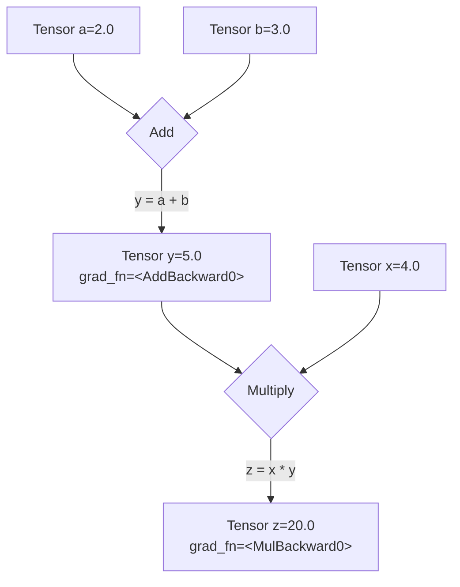

# **Give Me 1 Hour, You Will Build and Train a Neural Network From Scratch**

## Intro

You've seen PyTorch code. Maybe in a research paper or a tutorial. You saw `model.train()`, `loss.backward()`, and `optimizer.step()`.

You wondered what they actually *do*.

Maybe you tried to read the documentation. Got hit with a wall of classes. `nn.Module`, `torch.optim`, computation graphs. It felt like opaque, magical black boxes.

**Here's the truth: They're not black boxes. They are elegant wrappers for the linear algebra and calculus you already know.**

The entire deep learning training process, from the simplest model to a giant LLM, is just a five-step algorithm. That's it. Everything else is just an implementation detail.

- The `nn.Linear` layer? It's just `X @ W + b`.
- The loss function? Just a formula to measure error, like `torch.mean((y - y_hat)**2)`.
- The magical `loss.backward()`? It's just your old friend, the chain rule (backpropagation), automated.
- The `optimizer.step()`? It's just the gradient descent update rule: `W -= learning_rate * W.grad`.

**In this guide, we'll implement the raw math first, then use PyTorch's professional tools.**

You'll see *why* the tools exist by first doing the work manually. Once you've implemented the raw math, the professional code becomes obvious—just a clean, powerful way to organize what you've already built.

**And it all boils down to these 5 steps.**

Master this five-step loop, and you can understand the training code for any model, from a simple regression to a state-of-the-art Large Language Model.

| Step | Concept (Math) | From Scratch (Raw Tensors) | Professional (`torch.nn`) |
| :--- | :--- | :--- | :--- |
| **1. Prediction** | Make a prediction: <br> `ŷ = f(X, θ)` | `y_hat = X @ W + b` | `y_hat = model(X)` |
| **2. Loss Calc** | Quantify the error: <br> `L = Loss(ŷ, y)` | `loss = torch.mean((y_hat - y)**2)` | `loss = criterion(y_hat, y)` |
| **3. Gradient Calc** | Find the slope of the loss: <br> `∇_θ L` | `loss.backward()` | `loss.backward()` |
| **4. Param Update** | Step down the slope: <br> `θ_t+1 = θ_t - η * ∇_θ L` | `W -= lr * W.grad` | `optimizer.step()` |
| **5. Gradient Reset** | Reset for the next loop. | `W.grad.zero_()` | `optimizer.zero_grad()` |

Even better—this loop is universal. The `model` in Step 1 might become a massive Transformer, and the `optimizer` in Step 4 might be a fancy one like Adam, but the fundamental five-step logic **never changes**.

This isn't an analogy. The `nn.Linear` layer used in LLMs is the *exact same* `X @ W + b` operation you will build in Part 2. The Feed-Forward Network inside a Transformer is the *exact same* stack of layers you will build in Part 4. You are learning the literal, fundamental building blocks of modern AI.

Give me one hour. We'll build your understanding from the ground up. Raw math, real code, and a clear path to the professional tools.

Ready? Let's begin.

## Part 1: The Core Data Structure - `torch.Tensor`

Welcome to PyTorch! Everything we do—from loading data to defining complex neural networks—will be built on one core object: the `torch.Tensor`.

**The Analogy:** Think of a `Tensor` as the fundamental building block, the basic "noun" of the PyTorch language. It's a multi-dimensional array, very similar to a NumPy array, but with special powers for deep learning that we will unlock step-by-step.

Our goal in this section is to master this single, crucial object: how to create it and how to understand its properties.

### 1.1. The Three Common Patterns for Creating Tensors

There are many ways to create a tensor, but they generally fall into three common patterns you'll see everywhere.

#### **Pattern 1: Direct Creation from Existing Data**
This is the most straightforward. You have a Python list of numbers, and you want to convert it into a PyTorch tensor using `torch.tensor()`.

```python
import torch

# Input: A standard Python list
data = [[1, 2, 3], [4, 5, 6]]
my_tensor = torch.tensor(data)

print(my_tensor)
```
**Output:**
```
tensor([[1, 2, 3],
        [4, 5, 6]])
```

---

#### **Pattern 2: Creation from a Desired Shape**
This is extremely common when building models. You don't know the exact values for your weights yet, but you know the dimensions (shape) you need.

*   `torch.ones()` or `torch.zeros()`: Fills the tensor with `1`s or `0`s.
*   `torch.randn()`: Fills the tensor with random numbers from a standard normal distribution. **This is the standard way to initialize a model's weights.**

```python
# Input: A shape tuple (2 rows, 3 columns)
shape = (2, 3)

# Create tensors with this shape
ones = torch.ones(shape)
zeros = torch.zeros(shape)
random = torch.randn(shape)

print(f"Ones Tensor:\n {ones}\n")
print(f"Zeros Tensor:\n {zeros}\n")
print(f"Random Tensor:\n {random}")
```
**Output:**
```
Ones Tensor:
 tensor([[1., 1., 1.],
        [1., 1., 1.]])

Zeros Tensor:
 tensor([[0., 0., 0.],
        [0., 0., 0.]])

Random Tensor:
 tensor([[ 0.3815, -0.9388,  1.6793],
        [-0.3421,  0.5898,  0.3609]])
```

---

#### **Pattern 3: Creation by Mimicking Another Tensor's Properties**
Often, you have an existing tensor and you need to create a new one that has the *exact same shape, data type, and is on the same device*. Instead of manually copying these properties, PyTorch provides handy `_like` functions.

```python
# Input: A 'template' tensor
template = torch.tensor([[1, 2], [3, 4]])

# Create new tensors with the same properties as the template
ones_like = torch.ones_like(template)
rand_like = torch.randn_like(template, dtype=torch.float) # dtype can be overridden

print(f"Template Tensor:\n {template}\n")
print(f"Ones_like Tensor:\n {ones_like}\n")
print(f"Randn_like Tensor:\n {rand_like}")
```
**Output:**
```
Template Tensor:
 tensor([[1, 2],
        [3, 4]])

Ones_like Tensor:
 tensor([[1, 1],
        [1, 1]])

Randn_like Tensor:
 tensor([[-1.1713, -0.2032],
        [ 0.3391, -0.8267]])
```

### 1.2. What's Inside a Tensor? Shape, Type, and Device

Every tensor has attributes that describe its metadata. The three you will use constantly are `.shape`, `.dtype`, and `.device`.

```python
# Let's create a tensor to inspect
tensor = torch.randn(2, 3)

print(f"Shape of tensor: {tensor.shape}")
print(f"Datatype of tensor: {tensor.dtype}")
print(f"Device tensor is stored on: {tensor.device}")
```
**Output:**
```
Shape of tensor: torch.Size([2, 3])
Datatype of tensor: torch.float32
Device tensor is stored on: cpu
```

Let's break these down:
*   **`.shape`**: This is a tuple that describes the dimensions of the tensor. `torch.Size([2, 3])` tells us it's a 2D tensor with 2 rows and 3 columns. This is the most important attribute for debugging your models. Mismatched shapes are the #1 source of errors in PyTorch.
*   **`.device`**: This tells you where the tensor's data is physically stored. By default, it's on the `cpu`. If you have a compatible GPU, you can move it there (`.to("cuda")`) for massive speedups.
*   **`.dtype`**: This describes the data type of the numbers inside the tensor. Notice it defaulted to `torch.float32`. This is not an accident, and it's critically important.

#### A Quick but Critical Note on `dtype`
Why `torch.float32` and not just regular integers (`int64`)? The answer is **gradients**.

Gradient descent, the engine of deep learning, works by making tiny, continuous adjustments to a model's weights. These adjustments are fractional numbers (like `-0.0012`), which require a floating-point data type. You can't nudge a parameter from `3` to `3.001` if your data type only allows whole numbers.

**Key Takeaway:**
*   Model parameters (weights and biases) **must** be a float type (`float32` is the standard).
*   Data that represents categories or counts (like word IDs) can be integers (`int64`).

---

We now know what a `torch.Tensor` is and how to create one using three common patterns. We've essentially learned about the raw material.

Now, let's explore the single most important switch that turns this simple data container into a core component of a dynamic learning machine. Let's move on to **Part 2: The Engine of Autograd**.

## Part 2: The Engine of Autograd - `requires_grad`

In Part 1, we learned that tensors are containers for numbers. But their real power comes from a system called **Autograd**, which stands for automatic differentiation. This is PyTorch's built-in gradient calculator.

**The Analogy:** If a tensor is the "noun" in PyTorch, then Autograd is the "nervous system." It connects all the operations and allows signals (gradients) to flow backward through the system, enabling learning.

Our goal here is to understand the *one simple switch* that activates this nervous system.

### 2.1. The "Magic Switch": `requires_grad=True`

By default, PyTorch assumes a tensor is just static data. To tell it that a tensor is a learnable parameter (like a model's weight or bias), you must set its `requires_grad` attribute to `True`.

This is the most important setting in all of PyTorch. It tells Autograd:
> "This is a parameter my model will learn. From now on, track every single operation that happens to it."

```python
# A standard data tensor (we don't need to calculate gradients for our input data)
x_data = torch.tensor([[1., 2.], [3., 4.]])
print(f"Data tensor requires_grad: {x_data.requires_grad}\n")

# A parameter tensor (we need to learn this, so we need gradients)
w = torch.tensor([[1.0], [2.0]], requires_grad=True)
print(f"Parameter tensor requires_grad: {w.requires_grad}")
```
**Output:**
```
Data tensor requires_grad: False

Parameter tensor requires_grad: True
```

### 2.2. The Computation Graph: How PyTorch Remembers

Once you set `requires_grad=True`, PyTorch starts building a **computation graph** behind the scenes. Think of it as a history of all the operations. Every time you perform an operation on a tensor that requires gradients, PyTorch adds a new node to this graph.

Let's build a simple one. We'll compute `z = x * y` where `y = a + b`.

```python
# Three parameter tensors that we want to learn
a = torch.tensor(2.0, requires_grad=True)
b = torch.tensor(3.0, requires_grad=True)
x = torch.tensor(4.0, requires_grad=True)

# First operation: y = a + b
y = a + b

# Second operation: z = x * y
z = x * y

print(f"Result of a + b: {y}")
print(f"Result of x * y: {z}")
```
**Output:**
```
Result of a + b: 5.0
Result of x * y: 20.0
```
The math is simple. But behind the scenes, PyTorch has built a graph connecting `a`, `b`, `x`, `y`, and `z`.

### 2.3. Peeking Under the Hood: The `.grad_fn` Attribute

How can we prove this graph exists? Every tensor that is the result of an operation on a `requires_grad` tensor will have a special attribute called `.grad_fn`. This attribute is a "breadcrumb" that points to the function that created it.

Let's inspect the tensors from our previous example.

```python
# z was created by multiplication
print(f"grad_fn for z: {z.grad_fn}")

# y was created by addition
print(f"grad_fn for y: {y.grad_fn}")

# a was created by the user, not by an operation, so it has no grad_fn
print(f"grad_fn for a: {a.grad_fn}")
```
**Output:**
```
grad_fn for z: <MulBackward0 object at 0x10f7d3d90>
grad_fn for y: <AddBackward0 object at 0x10f7d3d90>
grad_fn for a: None
```
This is the tangible proof of the computation graph. PyTorch knows `z` came from a multiplication (`MulBackward0`) and `y` came from an addition (`AddBackward0`). When we later ask it to compute gradients, it will use this information to trace its way backward through the graph using the chain rule.

### 2.4. Visualizing the Graph

Here is what the graph we just created looks like. The `grad_fn` is the "arrow" leading to each new tensor.



---

We have now learned how to activate PyTorch's "nervous system" by setting `requires_grad=True`. This allows PyTorch to build a computation graph and remember the history of all operations.

We have built the network of roads. In the next parts, we'll learn the common operations (the "verbs") and then see how to send the gradient signal flowing backward along these roads to enable learning. Let's move on to **Part 3: Basic Mathematical & Reduction Operations**.

## Part 3: Basic Mathematical & Reduction Operations

We have our `Tensor` (the noun) and `Autograd` (the nervous system). Now we need **operations** (the verbs) to describe the calculations our model will perform. In deep learning, the vast majority of these operations are surprisingly simple: matrix multiplications and aggregations.

Our goal is to master these core verbs and, most importantly, the critical `dim` argument that controls how they work.

### 3.1. Mathematical Operations: `*` vs. `@`

This is the single most common point of confusion for beginners. PyTorch has two very different kinds of multiplication.

**1. Element-wise Multiplication (`*`)**
This operation multiplies elements in the same position. It's like overlaying two tensors and multiplying the corresponding cells. The tensors **must have the same shape**.

```python
a = torch.tensor([[1, 2], [3, 4]])
b = torch.tensor([[10, 20], [30, 40]])

# Calculation: [[1*10, 2*20], [3*30, 4*40]]
element_wise_product = a * b

print(f"Tensor a:\n {a}\n")
print(f"Tensor b:\n {b}\n")
print(f"Element-wise Product (a * b):\n {element_wise_product}")
```
**Output:**
```
Tensor a:
 tensor([[1, 2],
        [3, 4]])

Tensor b:
 tensor([[10, 20],
        [30, 40]])

Element-wise Product (a * b):
 tensor([[ 10,  40],
        [ 90, 160]])
```

---

**2. Matrix Multiplication (`@`)**
This is the standard matrix product from linear algebra. It's the core operation of every `Linear` layer in a neural network. For `m1 @ m2`, the number of columns in `m1` must equal the number of rows in `m2`.

```python
