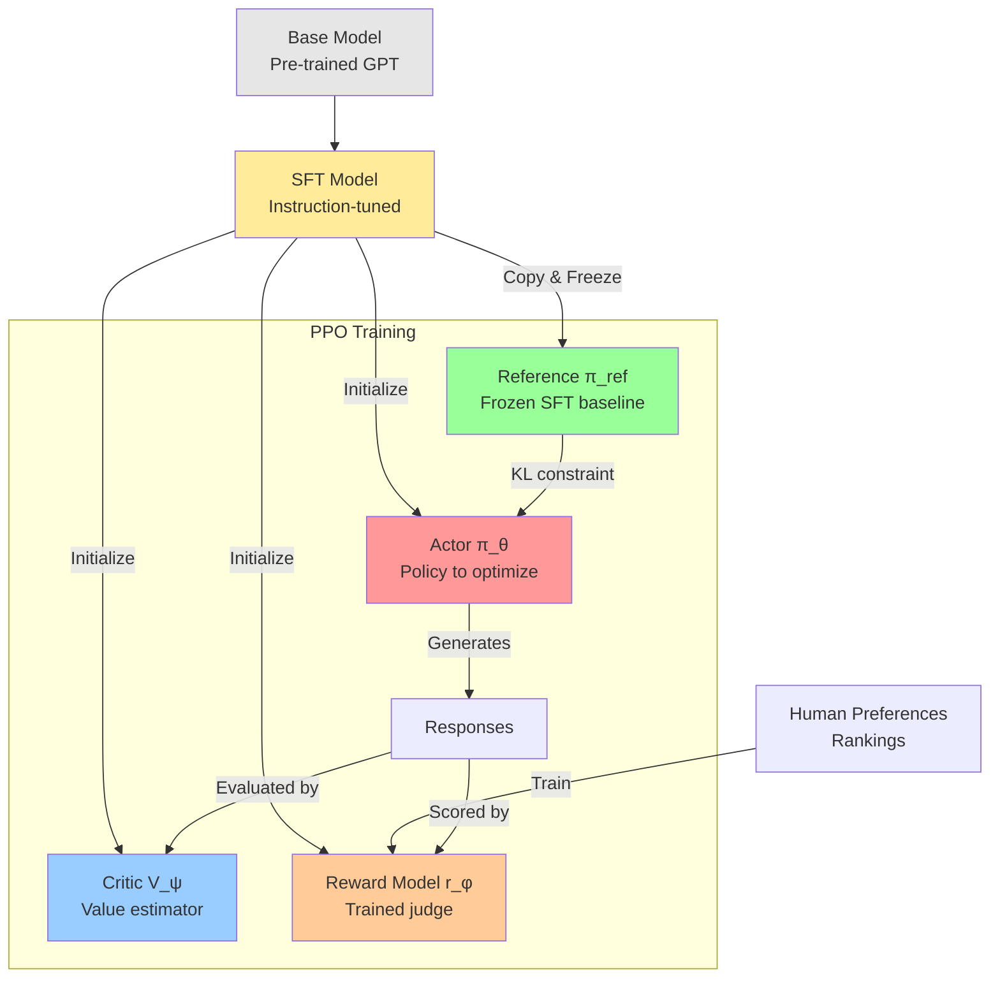

# **RLHF + PPO: The Mathematics Behind ChatGPT**

## **Introduction**

You've heard about RLHF - Reinforcement Learning from Human Feedback. It's the technique that transformed GPT into ChatGPT. But how does it actually work?

Given a base language model, RLHF optimizes this objective:

$$ \text{Objective} (\phi) = \mathbb{E}_{x \sim D, y \sim \pi_{\phi}^{RL}} [r_\theta(x,y)] - \beta \cdot \text{KL}\left( \pi_{\phi}^{RL} || \pi^{SFT} \right) $$

Simple enough - maximize reward while staying close to a reference model. But implementing this requires solving several hard problems, leading to this complex PPO loss function:

$$ \mathcal{L}^{\text{PPO}}(\theta) = \mathbb{E}_{t}\left[\min\left(r_t(\theta)A_t, \text{clip}(r_t(\theta), 1-\epsilon, 1+\epsilon)A_t\right)\right] - c_1 \cdot \mathcal{L}^{VF}_t + c_2 \cdot S[\pi_\theta] $$

We're going to build up to this formula step by step, understanding why each term is necessary.

**The theory is elegant, but how do we actually implement it?** Here's the complete training pipeline:



Why do we need all these models? What's an Actor? What's a Critic? Why keep a frozen reference? These aren't arbitrary choices - each component solves a specific failure mode of naive reinforcement learning.

Let's start from the beginning.

## **Step 1: Supervised Fine-Tuning - The Expensive Foundation**

**The problem with base models:** Ask a raw GPT model "What's the capital of France?" and it might respond with:
```
What's the capital of France?
A) London  B) Paris  C) Berlin  D) Rome
```

It's completing the text pattern (turning your question into a quiz), not answering you. Base models are trained to predict text, not follow instructions.

The first step toward alignment is **Supervised Fine-Tuning (SFT)** - teaching the model what helpful responses look like through examples.

**The Intuition: From Predictor to Assistant**

The core idea of SFT is to take our pre-trained base model and train it further on a much smaller, but extremely high-quality, curated dataset. This dataset doesn't contain random internet text; it's composed of thousands of example conversations where a human has written the ideal assistant's response.

**The Process**

The SFT process involves two main parts: data collection and training.

1.  **Data Collection: The Expensive Part**
    This is the most labor-intensive step in the entire alignment process. A team of human labelers is hired to manually create a dataset of `(prompt, ideal_response)` pairs.
    *   **Prompts (`x`):** These are sample inputs a user might give, covering a wide range of tasks: questions, requests for summaries, creative writing prompts, etc.
    *   **Ideal Responses (`y`):** For each prompt, a labeler writes a high-quality, helpful, and harmless response. This is difficult and expensive because it requires creativity, domain knowledge, and careful attention to detail. The labeler isn't just answering a question; they are demonstrating the *ideal behavior* of an AI assistant.

    For example, a data point might look like this:

    | Prompt | Ideal Response (written by a human labeler) |
    | :--- | :--- |
    | "Explain the concept of thermal expansion in simple terms." | "Of course! Thermal expansion is the tendency of matter to change its shape, area, and volume in response to a change in temperature. In simple terms, when you heat something up, its tiny particles (atoms and molecules) start to move around more and take up more space. This makes the object expand. A common example is the mercury in an old-fashioned thermometer; as it gets warmer, the mercury expands and rises up the tube." |

2.  **The Training**
    Once this dataset is collected, we fine-tune the base model on it. The training objective is the same as in pre-training: **predict the next token**. The model is trained to minimize the cross-entropy loss, meaning it learns to assign a very high probability to the sequence of tokens in the human-written `ideal_response`.

    In essence, we are teaching the model to **imitate the expert human labeler**.

**What We Get: The SFT Model**

After SFT, our model is transformed. It's no longer just a text completer; it's a capable apprentice.

| Characteristic | Pre-trained Base Model (The Parrot) | SFT Model (The Apprentice) |
| :--- | :--- | :--- |
| **Training Goal** | Predict the next word in *any* text. | Imitate expert-written responses to specific prompts. |
| **Training Data**| Unstructured internet text. | Curated `(prompt, ideal_response)` pairs. |
| **Behavior** | Completes text patterns; no sense of user intent. | Follows instructions; adopts a helpful persona. |
| **Key Weakness** | Doesn't know how to be a helpful assistant. | Assumes there is only one "perfect" answer for every prompt. |

The SFT model is a massive improvement. It understands conversational structure and follows instructions. For many applications, this is a significant step. However, it has a fundamental weakness that prevents it from reaching the next level of quality.

**The Critical Limitation**

SFT operates under a black-and-white assumption: the provided `ideal_response` is 100% correct, and any other response is implicitly wrong. The real world, however, is full of nuance.

Consider these two AI-generated summaries for an article:

*   **Response A:** "The article discusses climate change, focusing on rising sea levels and CO2 emissions. It mentions policy solutions." (Factually correct, but basic).
*   **Response B:** "The article provides a detailed analysis of climate change, attributing rising sea levels primarily to thermal expansion and glacial melt. It contrasts market-based policy solutions, like carbon taxes, with regulatory approaches." (More detailed, nuanced, and helpful).

As a human, you can instantly state a preference: **B is better than A**.

The SFT paradigm has no way to learn this. It can only imitate a single "perfect" answer. If we wanted to teach the model that B is better, we would have to throw away A and add B to the SFT dataset. But what if a third response, C, is even better? This process of constantly writing a new "perfect" answer is slow, expensive, and doesn't capture the rich, relative nature of human preferences.

This limitation leads us to a powerful economic and practical insight that will motivate the rest of the RLHF process.

## **The Economic Insight: Judging is Easier Than Creating**

SFT works, but it has a fatal flaw: it requires humans to write "perfect" responses. This is expensive and doesn't capture the nuanced nature of quality.

**Here's the key insight:** Imagine I ask you to:

**Task 1 - Create the perfect response:**
> "Write the perfect email to decline a meeting invitation. Be polite, professional, suggest alternatives, and match the right tone."

This is hard! You'd need to think carefully about wording, tone, context, alternatives. It might take 5-10 minutes to craft something great.

**Task 2 - Just rank these:**
> Response A: "Sorry, can't make it to the meeting."
>
> Response B: "Thank you for the invitation. Unfortunately, I have a conflict during that time. Would next Tuesday work instead?"

This takes 30 seconds. B is clearly better. You know it instantly.

**The breakthrough:** We can collect preference data (rankings) 10-20x faster than perfect demonstrations. Instead of writing one perfect response, a human can rank dozens of AI-generated responses in the same time.

This efficiency gap means we can collect preference data at a much larger scale and for a fraction of the cost of SFT data. If we can find a way to train our model using this cheaper, more abundant data, we can achieve a much higher level of alignment.

**Building the Preference Dataset**

This insight leads to a new data collection pipeline.

1.  Take a prompt from our dataset.
2.  Use our SFT model (the apprentice from Chapter 1) to generate several different responses (e.g., Response A, B, C, D).
3.  Present these responses to a human labeler and ask them to **rank** them from best to worst. For example, the labeler might decide `B > A > D > C`.
4.  This single ranking is then broken down into a set of pairwise comparisons. From the ranking `B > A > D > C`, we can derive several data points:
    *   `(prompt, chosen: B, rejected: A)`
    *   `(prompt, chosen: B, rejected: D)`
    *   `(prompt, chosen: B, rejected: C)`
    *   `(prompt, chosen: A, rejected: D)`
    *   ...and so on.

The final result is a large dataset, let's call it `D_prefs`, full of tuples of the form: `(x, y_w, y_l)`, where `x` is the prompt, `y_w` is the "winner" (chosen) response, and `y_l` is the "loser" (rejected) response.

**Two Paths Forward**

Now that we have this powerful new dataset, we arrive at a fork in the road. There are two modern, competing philosophies on how to use this preference data to improve our SFT model.

| Path | **Direct Preference Optimization (DPO)** | **Reinforcement Learning from Human Feedback (RLHF)** |
| :--- | :--- | :--- |
| **Philosophy** | Use preferences to **directly** adjust the policy's probabilities. It's an elegant, single-stage process. | Use preferences to first train a separate **Reward Model**, then use that model as a reward function to train the policy with RL. It's a more complex, multi-stage process. |
| **Analogy** | A language coach gives you specific edits: "Instead of saying X, say Y." | You hire a judge who gives a score to every speech you make. You then practice relentlessly to maximize your score from that judge. |
| **Our Focus** | (Mentioned for context, but not our focus). | **This is the path we will explore in this tutorial.** It is the method used by the original InstructGPT and early versions of ChatGPT. |

Both DPO and RLHF are powerful techniques that start from the same core insight of using preference data. For this tutorial, we will follow the RLHF path, as it was the pioneering method that demonstrated the incredible power of aligning models with human feedback at scale.

Our next step on this path is clear: if we want to use a "judge" to train our model, we first need to build that judge. In the next part of our journey, we will dive into training the **Reward Model**.
---

## **Step 2: Training the Reward Model**

We've made a crucial decision: instead of directly teaching our SFT model with preference data, we're going to build an automated "judge" that learns to mimic the human labeler. This judge is called the **Reward Model (RM)**. Its sole purpose is to take any `(prompt, response)` pair and output a single scalar score that represents "quality" or "human preference."

**Why We Need an Automated Judge**

You might ask, "Why the extra step? Why not just use the human feedback directly?"

The answer is **scalability and speed**. During the final Reinforcement Learning stage, our policy model will generate tens of thousands, or even millions, of responses. We can't ask a human to score every single one in real-time. That would be incredibly slow and prohibitively expensive.

The Reward Model solves this. Once trained, it acts as a fast and cheap proxy for the human labeler. It can score a batch of a thousand responses in a fraction of a second, providing the near-instant feedback signal required for efficient RL training.

**The Mathematics: Bradley-Terry Model**

The goal is to train a model, let's call its parameters `θ`, that produces a scalar score `r_θ(x, y)`. How do we use our preference dataset `D_prefs` of `(x, y_w, y_l)` tuples to train this model?

We rely on a simple but powerful idea from statistics: the **Bradley-Terry model**. It provides a way to model the probability of one item being preferred over another based on their underlying scores.

1.  **The Core Assumption:** We assume that for any given prompt `x`, every possible response `y` has a latent, hidden "quality score" given by our reward model `r_θ(x, y)`. When a human prefers `y_w` over `y_l`, it's because the true score of `y_w` is higher than the true score of `y_l`.

2.  **Modeling the Probability:** The Bradley-Terry model states that the probability of a human preferring `y_w` over `y_l` is proportional to the *difference* in their scores. We can formalize this using the sigmoid function (`σ`), which neatly squashes any real number into a probability between 0 and 1.

    $$ P(y_w \succ y_l | x) = \sigma(r_\theta(x, y_w) - r_\theta(x, y_l)) $$

    Let's break this down:
    *   If `r_θ(x, y_w)` is much larger than `r_θ(x, y_l)`, the difference is a large positive number. `σ(large_positive)` is close to 1. Our model is confident that `y_w` is the winner.
    *   If `r_θ(x, y_w)` is roughly equal to `r_θ(x, y_l)`, the difference is near zero. `σ(0)` is 0.5. Our model is uncertain, predicting a 50/50 chance.
    *   If `r_θ(x, y_w)` is much smaller than `r_θ(x, y_l)`, the difference is a large negative number. `σ(large_negative)` is close to 0. Our model is confident it has the scores backwards for this pair.

**Converting Preferences to Loss**

Now that we can model this probability, training the Reward Model is straightforward. We want to adjust the parameters `θ` to maximize the probability of the human judgments we actually observed in our dataset. This is a classic maximum likelihood problem, which we can solve by minimizing the **Negative Log-Likelihood**.

For a single preference pair `(x, y_w, y_l)`, the loss is:

$$ \text{loss} = -\log \left( P(y_w \succ y_l | x) \right) $$

Substituting our Bradley-Terry formula, we get the final loss function for the Reward Model, which is averaged over the entire preference dataset `D_prefs`:

$$ \mathcal{L}(\theta) = -\mathbb{E}_{(x, y_w, y_l) \sim D_{prefs}} \left[ \log \sigma(r_\theta(x, y_w) - r_\theta(x, y_l)) \right] $$

This loss function has a formally similar logistic form to Direct Preference Optimization (DPO), but the *targets differ significantly*:

- **RM (this approach)**: We learn a scalar reward function `r_θ(x,y)` from pairwise preferences, then use this as a separate scoring component.
- **DPO**: We update the **policy directly** by contrasting `log π_φ(y|x) - log π_ref(y|x)` with preference labels, bypassing the separate reward model entirely.

Both use formally similar logistic losses, but applied to different quantities and training objectives.

We have now defined *what* we want our automated judge to learn. But theory is one thing - how do we actually implement this? Let's see the code.

## **Implementing the Reward Model: Brain Surgery on a Transformer**

The theory tells us we need a model that outputs scalar scores. But why not just use a simple classifier? Why do we need "brain surgery" on a full transformer?

**The problem is harder than it looks.** A reward model needs to understand:
- Complex nuanced language (is this response helpful vs preachy?)
- Context and intent (same words, different meaning based on the question)
- Subtle quality differences (both responses are factual, but one flows better)

**Key insight: Reuse the SFT model for reward modeling.** Instead of training from scratch, we take our instruction-tuned SFT model and modify it. It already understands language and instruction-following - we just need to change its output from tokens to scores. Here's how we transform a GPT model to do exactly that. The most effective and data-efficient way to create a powerful RM is not to train one from scratch, but to adapt an existing, capable language model. This process is like performing "brain surgery" on our SFT model to give it a new function: judging instead of generating.

**Starting Point: Standard GPT Architecture**

Let's begin with a minimal, but complete, implementation of a GPT-style transformer. This model's architecture is designed for one primary task: predicting the next token in a sequence.

Pay close attention to the `forward` method and the `lm_head` layer. This is where the model produces its final output.

```python
# gpt_for_generation.py
import torch
import torch.nn as nn
import torch.nn.functional as F

# --- Boilerplate Transformer Blocks (Self-Attention, MLP, etc.) ---
# (Full implementation code as provided in the prompt)
# class CausalSelfAttention(nn.Module): ...
# class MLP(nn.Module): ...
# class Block(nn.Module): ...

class GPT(nn.Module):
    def __init__(self, config: GPTConfig):
        super().__init__()
        self.config = config
        
        # The main body of the transformer
        self.transformer = nn.ModuleDict(dict(
            wte = nn.Embedding(config.vocab_size, config.n_embd),
            wpe = nn.Embedding(config.block_size, config.n_embd),
            drop = nn.Dropout(config.dropout),
            h = nn.ModuleList([Block(config) for _ in range(config.n_layer)]),
            ln_f = nn.LayerNorm(config.n_embd),
        ))
        
        # The 'language model head' for generation
        self.lm_head = nn.Linear(config.n_embd, config.vocab_size, bias=False)
        self.lm_head.weight = self.transformer.wte.weight # Weight tying

    def forward(self, idx: torch.Tensor) -> torch.Tensor:
        # Standard transformer forward pass
        B, T = idx.size()
        pos = torch.arange(0, T, dtype=torch.long, device=idx.device).unsqueeze(0)
        tok_emb = self.transformer.wte(idx)
        pos_emb = self.transformer.wpe(pos)
        x = self.transformer.drop(tok_emb + pos_emb)
        for block in self.transformer.h:
            x = block(x)
        x = self.transformer.ln_f(x)
        
