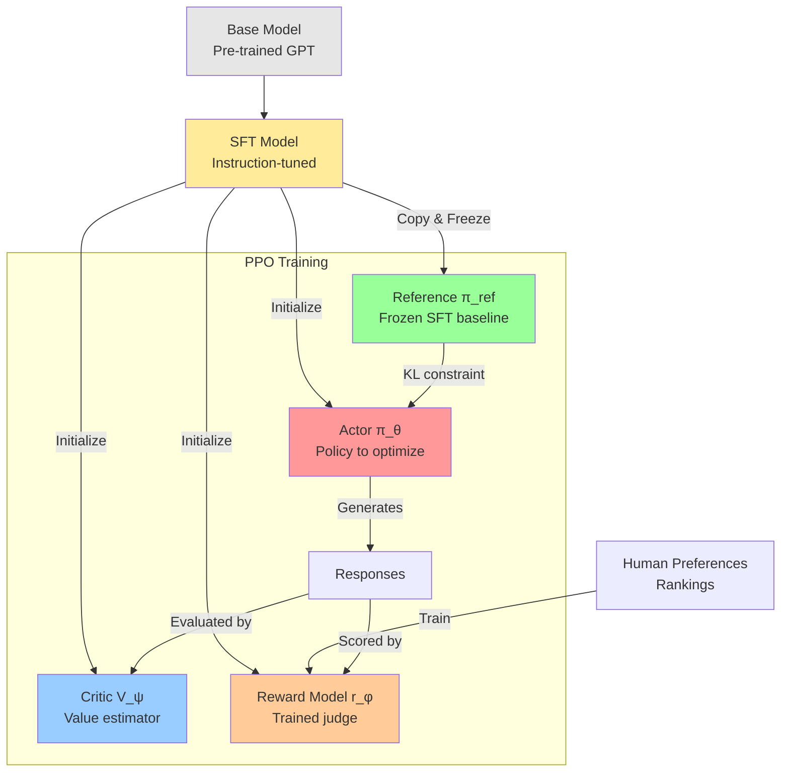

# **RLHF + PPO: The Mathematics Behind ChatGPT**

## **Introduction**

You've heard about RLHF - Reinforcement Learning from Human Feedback. It's the technique that transformed GPT into ChatGPT. But how does it actually work?

Given a base language model, RLHF optimizes this objective:

$$ \text{Objective} (\phi) = \mathbb{E}_{x \sim D, y \sim \pi_{\phi}^{RL}} [r_\theta(x,y)] - \beta \cdot \text{KL}\left( \pi_{\phi}^{RL} || \pi^{SFT} \right) $$

Simple enough - maximize reward while staying close to a reference model. But implementing this requires solving several hard problems, leading to this complex PPO loss function:

$$ \mathcal{L}^{\text{PPO}}(\theta) = \mathbb{E}_{t}\left[\min\left(r_t(\theta)A_t, \text{clip}(r_t(\theta), 1-\epsilon, 1+\epsilon)A_t\right)\right] - c_1 \cdot \mathcal{L}^{VF}_t + c_2 \cdot S[\pi_\theta] $$

We're going to build up to this formula step by step, understanding why each term is necessary.

**The theory is elegant, but how do we actually implement it?** Here's the complete training pipeline:



Why do we need all these models? What's an Actor? What's a Critic? Why keep a frozen reference? These aren't arbitrary choices - each component solves a specific failure mode of naive reinforcement learning.

Let's start from the beginning.

## **Step 1: Supervised Fine-Tuning - The Expensive Foundation**

**The problem with base models:** Ask a raw GPT model "What's the capital of France?" and it might respond with:
```
What's the capital of France?
A) London  B) Paris  C) Berlin  D) Rome
```

It's completing the text pattern (turning your question into a quiz), not answering you. Base models are trained to predict text, not follow instructions.

The first step toward alignment is **Supervised Fine-Tuning (SFT)** - teaching the model what helpful responses look like through examples.

**The Intuition: From Predictor to Assistant**

The core idea of SFT is to take our pre-trained base model and train it further on a much smaller, but extremely high-quality, curated dataset. This dataset doesn't contain random internet text; it's composed of thousands of example conversations where a human has written the ideal assistant's response.

**The Process**

The SFT process involves two main parts: data collection and training.

1.  **Data Collection: The Expensive Part**
    This is the most labor-intensive step in the entire alignment process. A team of human labelers is hired to manually create a dataset of `(prompt, ideal_response)` pairs.
    *   **Prompts (`x`):** These are sample inputs a user might give, covering a wide range of tasks: questions, requests for summaries, creative writing prompts, etc.
    *   **Ideal Responses (`y`):** For each prompt, a labeler writes a high-quality, helpful, and harmless response. This is difficult and expensive because it requires creativity, domain knowledge, and careful attention to detail. The labeler isn't just answering a question; they are demonstrating the *ideal behavior* of an AI assistant.

    For example, a data point might look like this:

    | Prompt | Ideal Response (written by a human labeler) |
    | :--- | :--- |
    | "Explain the concept of thermal expansion in simple terms." | "Of course! Thermal expansion is the tendency of matter to change its shape, area, and volume in response to a change in temperature. In simple terms, when you heat something up, its tiny particles (atoms and molecules) start to move around more and take up more space. This makes the object expand. A common example is the mercury in an old-fashioned thermometer; as it gets warmer, the mercury expands and rises up the tube." |

2.  **The Training**
    Once this dataset is collected, we fine-tune the base model on it. The training objective is the same as in pre-training: **predict the next token**. The model is trained to minimize the cross-entropy loss, meaning it learns to assign a very high probability to the sequence of tokens in the human-written `ideal_response`.

    In essence, we are teaching the model to **imitate the expert human labeler**.

**What We Get: The SFT Model**

After SFT, our model is transformed. It's no longer just a text completer; it's a capable apprentice.

| Characteristic | Pre-trained Base Model (The Parrot) | SFT Model (The Apprentice) |
| :--- | :--- | :--- |
| **Training Goal** | Predict the next word in *any* text. | Imitate expert-written responses to specific prompts. |
| **Training Data**| Unstructured internet text. | Curated `(prompt, ideal_response)` pairs. |
| **Behavior** | Completes text patterns; no sense of user intent. | Follows instructions; adopts a helpful persona. |
| **Key Weakness** | Doesn't know how to be a helpful assistant. | Assumes there is only one "perfect" answer for every prompt. |

The SFT model is a massive improvement. It understands conversational structure and follows instructions. For many applications, this is a significant step. However, it has a fundamental weakness that prevents it from reaching the next level of quality.

**The Critical Limitation**

SFT operates under a black-and-white assumption: the provided `ideal_response` is 100% correct, and any other response is implicitly wrong. The real world, however, is full of nuance.

Consider these two AI-generated summaries for an article:

*   **Response A:** "The article discusses climate change, focusing on rising sea levels and CO2 emissions. It mentions policy solutions." (Factually correct, but basic).
*   **Response B:** "The article provides a detailed analysis of climate change, attributing rising sea levels primarily to thermal expansion and glacial melt. It contrasts market-based policy solutions, like carbon taxes, with regulatory approaches." (More detailed, nuanced, and helpful).

As a human, you can instantly state a preference: **B is better than A**.

The SFT paradigm has no way to learn this. It can only imitate a single "perfect" answer. If we wanted to teach the model that B is better, we would have to throw away A and add B to the SFT dataset. But what if a third response, C, is even better? This process of constantly writing a new "perfect" answer is slow, expensive, and doesn't capture the rich, relative nature of human preferences.

This limitation leads us to a powerful economic and practical insight that will motivate the rest of the RLHF process.

## **The Economic Insight: Judging is Easier Than Creating**

SFT works, but it has a fatal flaw: it requires humans to write "perfect" responses. This is expensive and doesn't capture the nuanced nature of quality.

**Here's the key insight:** Imagine I ask you to:

**Task 1 - Create the perfect response:**
> "Write the perfect email to decline a meeting invitation. Be polite, professional, suggest alternatives, and match the right tone."

This is hard! You'd need to think carefully about wording, tone, context, alternatives. It might take 5-10 minutes to craft something great.

**Task 2 - Just rank these:**
> Response A: "Sorry, can't make it to the meeting."
>
> Response B: "Thank you for the invitation. Unfortunately, I have a conflict during that time. Would next Tuesday work instead?"

This takes 30 seconds. B is clearly better. You know it instantly.

**The breakthrough:** We can collect preference data (rankings) 10-20x faster than perfect demonstrations. Instead of writing one perfect response, a human can rank dozens of AI-generated responses in the same time.

This efficiency gap means we can collect preference data at a much larger scale and for a fraction of the cost of SFT data. If we can find a way to train our model using this cheaper, more abundant data, we can achieve a much higher level of alignment.

**Building the Preference Dataset**

