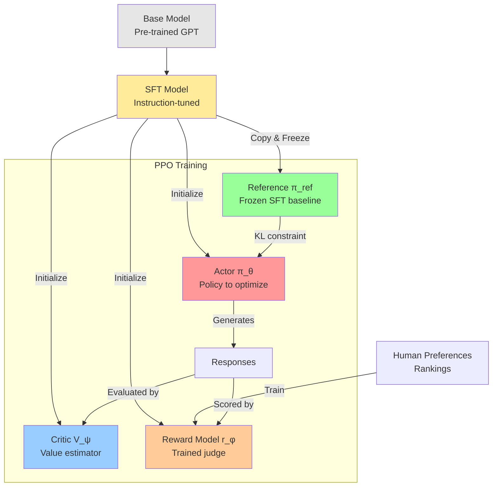

# **RLHF + PPO: The Mathematics Behind ChatGPT**

## **Introduction**

You've heard about RLHF - Reinforcement Learning from Human Feedback. It's the technique that transformed GPT into ChatGPT. But how does it actually work?

Given a base language model, RLHF optimizes this objective:

$$ \text{Objective} (\phi) = \mathbb{E}_{x \sim D, y \sim \pi_{\phi}^{RL}} [r_\theta(x,y)] - \beta \cdot \text{KL}\left( \pi_{\phi}^{RL} || \pi^{SFT} \right) $$

Simple enough - maximize reward while staying close to a reference model. But implementing this requires solving several hard problems, leading to this complex PPO loss function:

$$ \mathcal{L}^{\text{PPO}}(\theta) = \mathbb{E}_{t}\left[\min\left(r_t(\theta)A_t, \text{clip}(r_t(\theta), 1-\epsilon, 1+\epsilon)A_t\right)\right] - c_1 \cdot \mathcal{L}^{VF}_t + c_2 \cdot S[\pi_\theta] $$

We're going to build up to this formula step by step, understanding why each term is necessary.

**The theory is elegant, but how do we actually implement it?** Here's the complete training pipeline:



Why do we need all these models? What's an Actor? What's a Critic? Why keep a frozen reference? These aren't arbitrary choices - each component solves a specific failure mode of naive reinforcement learning.

Let's start from the beginning.

## **Step 1: Supervised Fine-Tuning - The Expensive Foundation**

**The problem with base models:** Ask a raw GPT model "What's the capital of France?" and it might respond with:
```
What's the capital of France?
A) London  B) Paris  C) Berlin  D) Rome
```

It's completing the text pattern (turning your question into a quiz), not answering you. Base models are trained to predict text, not follow instructions.

The first step toward alignment is **Supervised Fine-Tuning (SFT)** - teaching the model what helpful responses look like through examples.

**The Intuition: From Predictor to Assistant**

The core idea of SFT is to take our pre-trained base model and train it further on a much smaller, but extremely high-quality, curated dataset. This dataset doesn't contain random internet text; it's composed of thousands of example conversations where a human has written the ideal assistant's response.

**The Process**

The SFT process involves two main parts: data collection and training.

