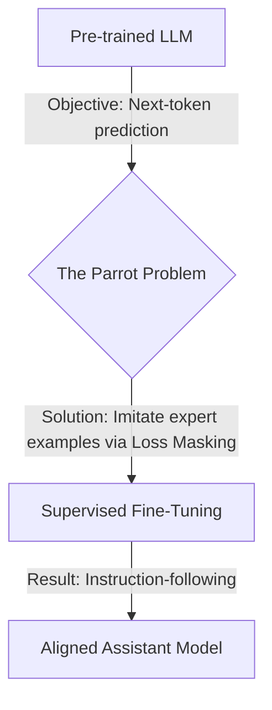

# **Title: Supervised Fine-Tuning in 30 Min**

## **Chapter 1: The Problem: Parrots, Not Assistants**

You've used models like ChatGPT or Claude. You give them an instruction, and they follow it. This behavior feels natural, but it is a carefully engineered facade. The underlying base model—fresh from its training on trillions of words—is not an assistant. It is a powerful, alien-like **text-completion engine**. Its sole objective is to predict the next word in a sequence with statistical accuracy.

This singular focus creates the **Parrot Problem**: the model becomes a master of mimicry without any concept of user intent.

Let's make this concrete. You prompt a raw, pre-trained base model (like the original GPT-3) with a question.

**Your Prompt:**
```
What is the primary cause of Earth's seasons?
```

**An Assistant's Expected Response:**
```
The primary cause of Earth's seasons is the tilt of the Earth's axis, which is about 23.5 degrees...
```

**The Base Model's Likely Response:**
```
What is the primary cause of Earth's seasons?
A) The Earth's distance from the sun.
B) The tilt of the Earth's axis relative to its orbital plane.
C) The speed of the Earth's rotation.
D) Ocean currents and wind patterns.
```

The model did not answer your question. It continued your text by formatting it into a multiple-choice question. Why? Because its pre-training data is saturated with quizzes and tests. From a purely statistical "next-word prediction" viewpoint, this is a highly probable completion for a sentence that starts with "What is...".

The model isn't being unhelpful. It is perfectly executing its objective: **completing a pattern**. It has no concept of a "user" or an "instruction." It only sees text.

This gap between a pattern-completing parrot and a helpful assistant is closed by a process called **post-training**. The first and most crucial step is **Supervised Fine-Tuning (SFT)**.

It sounds complex, but the entire engineering challenge of SFT boils down to crafting a single, clever data transformation function.

**My promise is this: In the next 30 minutes, you will learn to write this exact function from scratch.** This is the complete logic that turns raw `(prompt, response)` pairs into trainable tensors for an LLM.

```python
import torch

def prepare_sft_batch(prompt: str, response: str, tokenizer):
    """
    This is the core engineering of SFT. It takes a prompt/response pair
    and creates the input_ids and the strategically masked labels.
    """
    # 1. Format the text with special tokens for conversation structure.
    prompt_part = f"<|user|> {prompt} <|end|> <|assistant|>"
    full_text = f"{prompt_part} {response} <|end|>"

    # 2. Tokenize to find the boundary for loss masking.
    # We only want to train the model on the assistant's response.
    prompt_ids = tokenizer.encode(prompt_part)
    mask_until_idx = len(prompt_ids)

    # 3. Tokenize the full conversation for model input.
    input_ids = tokenizer.encode(full_text)

    # 4. Create the labels tensor by cloning the input_ids.
    labels = torch.tensor(input_ids).clone()

    # 5. Apply the mask. This is the critical step.
    # We replace the prompt tokens in the labels with -100.
    labels[:mask_until_idx] = -100

    return {
        "input_ids": torch.tensor(input_ids),
        "labels": labels
    }
```
That's the entire trick. The rest is just standard model training. PyTorch's loss function is hard-coded to ignore `-100` values, so by feeding it these `labels`, we force the model to learn one thing: "When you see `<|assistant|>`, generate the expert response."

By mastering this function, you master SFT.


Our journey will take us from the problem to the complete solution.



To understand *why* this data transformation is so effective, we must first master the engine it modifies. In the next chapter, we will dissect the mathematical core of pre-training—Cross-Entropy Loss—to see exactly how the parrot learns to talk in the first place.

## **Chapter 2: The Engine of Pre-training: Cross-Entropy Loss**

Before we can teach a model to be an assistant, we must first understand how it learned to be a parrot. The vast knowledge of a base LLM is forged during its **pre-training** phase, where it is trained on a single, brutally simple objective: **next-token prediction**.

The rule is this: given a sequence of text, predict the very next token. That's it. The model is a highly sophisticated pattern-completion machine. To teach it this skill, we use the standard workhorse of deep learning classification: **Cross-Entropy Loss**.

Cross-Entropy Loss is a way to measure how "surprised" a model is by the correct answer. If the model assigns a high probability to the correct next token, the loss is low (low surprise). If it assigns a very low probability, the loss is high (high surprise).

Mathematically, this simplifies to calculating the **negative log-probability** of the correct target token.

Let's make this concrete with a minimal example that you can calculate by hand.

Imagine a tiny model with a vocabulary of only six words.

