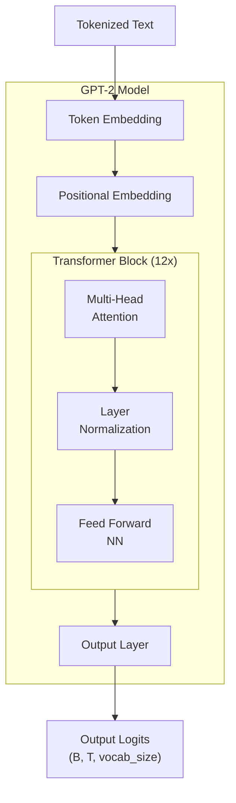

# Give me 90 minutes, I will make Transformer click forever

## **Chapter 1: The Big Picture & Our Blueprint**

You've likely used ChatGPT or a similar large language model. You type a question, and a coherent, well-written answer appears. It feels like magic. It can write poetry, debug code, and explain complex topics. But what if I told you that the core engine behind this apparent intelligence is not some unknowable black box?

What if I told you... this is the entire secret?

```python
# gpt2_min.py
import math
from dataclasses import dataclass
import torch
import torch.nn as nn
import torch.nn.functional as F

@dataclass
class GPTConfig:
    vocab_size: int
    block_size: int
    n_layer: int = 12
    n_head: int = 12
    n_embd: int = 768
    dropout: float = 0.1

class CausalSelfAttention(nn.Module):
    def __init__(self, config: GPTConfig):
        super().__init__()
        assert config.n_embd % config.n_head == 0
        self.n_head, self.n_embd = config.n_head, config.n_embd
        self.c_attn = nn.Linear(config.n_embd, 3 * config.n_embd)
        self.c_proj = nn.Linear(config.n_embd, config.n_embd)
        self.resid_drop = nn.Dropout(config.dropout)
        self.register_buffer("bias", torch.tril(torch.ones(config.block_size, config.block_size)).view(1, 1, config.block_size, config.block_size))
    def forward(self, x):
        B, T, C = x.size()
        qkv = self.c_attn(x)
        q, k, v = qkv.split(self.n_embd, dim=2)
        head_dim = C // self.n_head
        q = q.view(B, T, self.n_head, head_dim).transpose(1, 2)
        k = k.view(B, T, self.n_head, head_dim).transpose(1, 2)
        v = v.view(B, T, self.n_head, head_dim).transpose(1, 2)
        att = (q @ k.transpose(-2, -1)) * (1.0 / math.sqrt(head_dim))
        att = att.masked_fill(self.bias[:, :, :T, :T] == 0, float("-inf"))
        att = F.softmax(att, dim=-1)
        y = att @ v
        y = y.transpose(1, 2).contiguous().view(B, T, C)
        return self.resid_drop(self.c_proj(y))

class MLP(nn.Module):
    def __init__(self, config: GPTConfig):
        super().__init__()
        self.fc = nn.Linear(config.n_embd, 4 * config.n_embd)
        self.proj = nn.Linear(4 * config.n_embd, config.n_embd)
        self.drop = nn.Dropout(config.dropout)
    def forward(self, x):
        return self.drop(self.proj(F.gelu(self.fc(x))))

class Block(nn.Module):
    def __init__(self, config: GPTConfig):
        super().__init__()
        self.ln_1 = nn.LayerNorm(config.n_embd)
        self.attn = CausalSelfAttention(config)
        self.ln_2 = nn.LayerNorm(config.n_embd)
        self.mlp = MLP(config)
    def forward(self, x):
        x = x + self.attn(self.ln_1(x))
        x = x + self.mlp(self.ln_2(x))
        return x

class GPT2(nn.Module):
    def __init__(self, config: GPTConfig):
        super().__init__()
        self.config = config
        self.wte = nn.Embedding(config.vocab_size, config.n_embd)
        self.wpe = nn.Embedding(config.block_size, config.n_embd)
        self.drop = nn.Dropout(config.dropout)
        self.h = nn.ModuleList([Block(config) for _ in range(config.n_layer)])
        self.ln_f = nn.LayerNorm(config.n_embd)
        self.lm_head = nn.Linear(config.n_embd, config.vocab_size, bias=False)
        self.lm_head.weight = self.wte.weight
    def forward(self, idx, targets=None):
        B, T = idx.size()
        pos = torch.arange(0, T, dtype=torch.long, device=idx.device).unsqueeze(0)
        x = self.wte(idx) + self.wpe(pos)
        x = self.drop(x)
        for block in self.h:
            x = block(x)
        x = self.ln_f(x)
        logits = self.lm_head(x)
        loss = F.cross_entropy(logits.view(-1, logits.size(-1)), targets.view(-1)) if targets is not None else None
        return logits, loss
```

That's it. These ~80 lines of Python and PyTorch contain all the fundamental architectural principles of a multi-billion dollar model like ChatGPT. There is no hidden magic.

In this tutorial, we are going to go through this file, line by line. You will understand not only **what** each line does, but **why** it's there—the core intuition behind it. By the end, the magic will dissolve into understandable, elegant engineering.

#### Our Promise and Roadmap

Our promise is simple: in the next 90 minutes, the Transformer will click for you forever. Our journey will follow this exact architecture:



This diagram is our roadmap.
1.  **Input:** We start at the bottom with our "Tokenized Text".
2.  **Embeddings:** We will first build the "Token Embedding" and "Positional Embedding" layers, which turn words and their positions into vectors.
3.  **The Core Engine:** We will then build the "Transformer Block". This is the heart of the model, containing "Multi-Head Attention" and a "Feed Forward NN". As the "12 X" indicates, the model's power comes from stacking these blocks repeatedly.
4.  **Output:** Finally, we will build the "Output Layer" that converts the final processed vectors back into a prediction.

The most important component we will build is the **Causal Self-Attention** mechanism, which follows this formula:
$$ \text{Attention}(Q, K, V) = \text{softmax}\left(\frac{QK^T}{\sqrt{d_k}} + M\right)V $$
Don't worry if this looks intimidating. We will build up to it slowly until it becomes second nature.

#### Our Blueprint: The `GPTConfig`

Every construction project starts with a blueprint. For our model, that blueprint is the `GPTConfig` class. It's a simple container that holds all the key architectural parameters.

```python
@dataclass
class GPTConfig:
    vocab_size: int
    block_size: int         # max sequence length (context window)
    n_layer: int = 12       # Number of Transformer Blocks to stack
    n_head: int = 12        # Number of attention "heads"
    n_embd: int = 768       # The dimensionality of our vectors
    dropout: float = 0.1
```
These are the knobs you can turn to change the size and power of the model.

| Parameter | What it Controls | Intuition | Real GPT-2 (Small) Value |
| :--- | :--- | :--- | :--- |
| `vocab_size` | Vocabulary Size | How many unique words/tokens the model knows. | 50257 |
| `block_size` | Context Window | The maximum number of tokens the model can look at simultaneously. | 1024 |
| `n_layer` | Model **Depth** | The number of `Block`s stacked on top of each other. More layers = more powerful. | 12 |
| `n_head` | Model **Width** | The number of parallel "conversations" attention can have. More heads = more perspectives. | 12 |
| `n_embd` | Embedding Dimension | The "size" of the vectors representing each token. | 768 |

By simply changing these numbers, you can create a tiny, toy model or the full-scale GPT-2. The underlying code for the architecture remains exactly the same.

With our blueprint in hand, we're ready to lay the first brick. In the next chapter, we will build the embedding layers that turn simple numbers into the rich vectors our model can understand.

## **Chapter 2: The Word-Vector Dictionary: Token Embeddings**

Our journey begins with the first functional layer. We must convert the raw input—a sequence of token IDs—into something a neural network can process.

Let's look at our blueprint and pinpoint the component we're building.
```python
class GPT2(nn.Module):
    def __init__(self, config):
        # We are building THIS line now.
        self.wte = nn.Embedding(config.vocab_size, config.n_embd) # Word Token Embedding
        self.wpe = nn.Embedding(...) # (Next chapter)

        # The rest of the model
        self.h = nn.ModuleList(...)
        self.ln_f = nn.LayerNorm(...)
        self.lm_head = nn.Linear(...)
```
#### The Input Problem: Meaningless Numbers

The input to our model is a tensor of token IDs, like `torch.tensor([[5, 21]])`. These are categorical numbers. The ID `21` doesn't have 4.2 times the "value" of ID `5`. The numerical distance between them is arbitrary and meaningless. A neural network, which relies on matrix multiplication and gradient descent, cannot learn from these raw IDs. They are just pointers.

#### The Goal: Mapping Words to a "Semantic Space"

Our goal is to create a learnable representation for each token. We want to map each token ID to a vector—a point in a high-dimensional space. The key idea is that the *location* of these points should be meaningful.

**Analogy: A Color Space.** Imagine we want to represent colors.
*   **Bad way (Categorical ID):** `{"red": 1, "orange": 2, "blue": 8}`. The number `8` for "blue" has no relation to `1` for "red".
*   **Good way (Vector/Coordinate):** Represent colors in a 2D space where the `x-axis` is "redness" and the `y-axis` is "blueness".
    *   `red` might be `(0.9, 0.1)`
    *   `orange` might be `(0.8, 0.2)` (close to red!)
    *   `blue` might be `(0.1, 0.9)` (far from red!)

Now, the distance between points is meaningful! We are going to do the same thing, but for words, in a space with `n_embd` (e.g., 768) dimensions.

#### The Mechanism: A Learnable Coordinate Book

The `nn.Embedding` layer is this coordinate book. It is a simple lookup table stored as a single weight matrix. Let's build it and inspect its contents.

```python
import torch
import torch.nn as nn

# A tiny config for our example
vocab_size = 10
n_embd = 3 # The number of dimensions in our "semantic space"

# The layer is our coordinate book
token_embedding_table = nn.Embedding(vocab_size, n_embd)

# The book itself is the `.weight` attribute. Each row is a word's coordinate.
print("Shape of our coordinate book:", token_embedding_table.weight.shape)
print("Content of the book (initially random coordinates):")
print(token_embedding_table.weight)
```
**Output:**
```
Shape of our coordinate book: torch.Size([10, 3])
Content of the book (initially random coordinates):
Parameter containing:
tensor([[-0.2185, -0.2291, -0.5435],  # Coordinate for token 0
        [ 0.6508,  0.4734, -0.4439],  # Coordinate for token 1
        [-0.3129,  1.6141,  0.2889],  # Coordinate for token 2
        ...
        [-1.0223, -0.2543, -0.3288]], # Coordinate for token 9
       requires_grad=True)
```
This is the core. We have a `(vocab_size, n_embd)` matrix. The `requires_grad=True` part is crucial: it means that during training, the model will learn the best possible coordinates for each word to minimize its prediction error.

#### The Power and The Insufficiency

Let's see the lookup in action and then discuss what this new representation gives us, and what it lacks.

```python
B, T = 2, 4 # Batch, Time
idx = torch.randint(0, vocab_size, (B, T)) # A batch of token ID sequences

# --- The Lookup ---
# For each ID in `idx`, we retrieve its coordinate vector from the table
tok_emb = token_embedding_table(idx)

print("Input IDs shape:", idx.shape)
print("Output Vectors (Coordinates) shape:", tok_emb.shape)
```
**Output:**
```
Input IDs shape: torch.Size([2, 4])
Output Vectors (Coordinates) shape: torch.Size([2, 4, 3])
```
We transformed our `(B, T)` integer tensor into a `(B, T, n_embd)` float tensor.

**So what have we gained?**
We now have a **context-free representation** of each word. During training, the model learns to place words with similar meanings near each other. This is what enables the famous analogy `vector('King') - vector('Man') + vector('Woman') ≈ vector('Queen')`. The vector for 'King' captures a concept of "maleness" and "royalty" that can be manipulated mathematically.

**But what is the insufficiency?**
This representation has one massive flaw: it is **static and context-free**. The vector for the word "bank" is identical in these two sentences:
1.  "I sat on the river **bank**."
2.  "I withdrew money from the **bank**."

The lookup table gives us a powerful starting point, but it's just a dictionary. It doesn't know anything about the words surrounding it.

This is the central problem the Transformer architecture is designed to solve. **How can a token's vector representation be dynamically adjusted based on its context?**

To even begin to answer that, we first need to give the model a sense of order. That is the subject of the next chapter: Positional Embeddings.


## **Chapter 3: Giving the Model a Sense of Order: Positional Embeddings**

In the last chapter, we created a "dictionary" that maps each word to a context-free vector. This vector represents the word's general meaning. However, our model still sees the input as just a collection—a "bag"—of these vectors. It has no idea about their order.

Language is all about order. "Dog bites man" is not the same as "Man bites dog." We must provide this crucial ordering information to the model.

Let's locate our next component in the blueprint.

```python
class GPT2(nn.Module):
    def __init__(self, config):
        self.wte = nn.Embedding(...) # (Done)

        # We are building THIS line now.
        self.wpe = nn.Embedding(config.block_size, config.n_embd) # Positional Embedding

        self.h = nn.ModuleList(...)
        self.ln_f = nn.LayerNorm(...)
        self.lm_head = nn.Linear(...)
```

#### The Problem: A Bag of Words

Our current output is a tensor of shape `(B, T, C)`, where `C` is `n_embd`. For a sequence like `["Man", "bites", "dog"]`, the model receives a set of three vectors: `{vector("Man"), vector("bites"), vector("dog")}`. If we shuffled the input, the model would receive the exact same set of vectors, just in a different order along the `T` dimension. The core processing layers (the Transformer blocks) are designed to be order-invariant, so without modification, they would produce the same result.

We need to explicitly "stamp" each token's vector with its position.

#### The Solution: A Learnable "Position Vector"

The solution used in GPT is wonderfully simple. Just as we learned a unique vector for each *word*, we will also learn a unique vector for each *position*.

*   We'll have a vector that means "I am at the 1st position."
*   We'll have another vector that means "I am at the 2nd position."
*   ...and so on, up to the maximum sequence length (`block_size`).

This is another `nn.Embedding` layer, but this time it's a lookup table for positions, not words. Its "vocabulary size" is the `block_size`. We then add this position vector to the corresponding token vector.

**Why does adding them work?**
Because the token and positional embeddings exist in the same high-dimensional space, the model can learn to interpret the combined vector. During training, it learns to create positional vectors such that adding `vector(pos=N)` to `vector(word=W)` produces a unique representation that distinguishes it from the same word at a different position. The network learns to "understand" this composition.

#### The Code: Building and Combining

Let's implement this. The key is to generate a sequence of position indices `(0, 1, 2, ...)` and use those to look up the positional vectors.

```python
import torch
import torch.nn as nn

# --- Our Config ---
B, T, C = 2, 5, 3  # Batch, Time (sequence length), Channels (n_embd)
vocab_size = 10
block_size = 8     # Our model's max sequence length is 8

# --- The Layers ---
token_embedding_table = nn.Embedding(vocab_size, C)
position_embedding_table = nn.Embedding(block_size, C)

# --- The Input Data ---
idx = torch.randint(0, vocab_size, (B, T)) # Shape (2, 5)

# --- Step 1: Get Token Embeddings (as before) ---
tok_emb = token_embedding_table(idx) # Shape (B, T, C) -> (2, 5, 3)

# --- Step 2: Get Positional Embeddings ---
# Note: Our input sequence length T=5, but block_size=8. This is fine.
# We just need the positions for our current sequence.
pos = torch.arange(0, T, dtype=torch.long) # Shape (T) -> tensor([0, 1, 2, 3, 4])
pos_emb = position_embedding_table(pos) # Shape (T, C) -> (5, 3)
